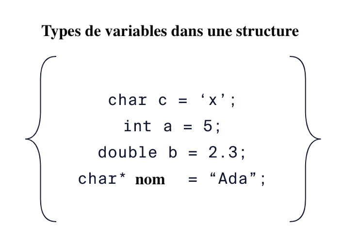
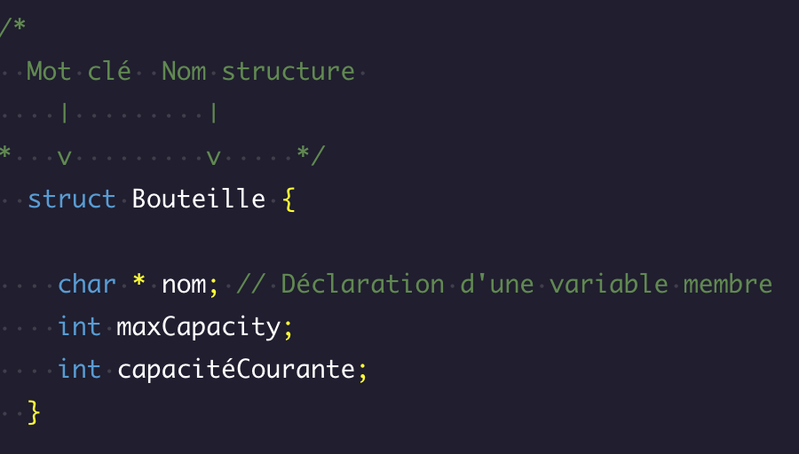

# Introduction


Tout au long de ce cours, nous avons défini de nombreux types de variables, tels que `int` et `char`. Ces types sont connus sous le nom de types de base et sont intégrés au langage C.

Nous avons également défini des types de données tels que les tableaux et les pointeurs, connus sous le nom de types dérivés. Les types dérivés ont tendance à être une collection de types de base pour créer un nouveau type de données plus puissant. Nous allons maintenant explorer un autre type dérivé, la structure.

En C, les structures permettent aux programmeurs de créer des types de données définis par l'utilisateur. Les structures, comme les tableaux, permettent de rassembler de nombreux types de données en un seul type de données. Mais contrairement aux tableaux, les structures peuvent être une collection de plusieurs types de données.



L'image ci-dessus représente une structure et les différents types de variables qu'elle contient. Ce type d'"emballage" est bénéfique car il permet de construire et de transmettre des données logiquement liées dans un seul type de données défini par l'utilisateur.

### À vous de jouer ! 🤠

1. Examinez et exécutez le code dans l'espace de travail. Remarquez toutes les variables qui sont définies. Réfléchissez à la manière dont vous pourriez utiliser des structures pour organiser les données.


```c
#include <stdio.h>

int main(void) {
  char prenom[] = "Ada";
  char nom[] = "Lovelace";
  int age = 28;
  char profession[] = "mathematicienne";

  printf("Je m'appelle %s %s, j'ai %d ans et je suis une  %s.", prenom, nom, age, profession);
}
```

## Définition des structures

Pour nous aider à comprendre comment inclure des structures (également appelées `structs`) dans notre code, voyons comment les définir :





dans l'image ci-dessus :

- Le mot-clé `struct` initie la définition du type de structure
- `Bouteille` est le nom du nouveau type de structure
- Un ensemble d'accolades, `{`, `}`, pour entourer les variables membres de la structure.
- À l'intérieur des accolades, les variables membres sont "emballées" ensemble.

Les variables membres peuvent être de n'importe quel type de base (int, char, etc.). 


Elles peuvent également être des types dérivés tels que des tableaux, des pointeurs et même d'autres structures. Il est important de noter que les variables membres ne doivent être que déclarées et non initialisées (nous y reviendrons plus tard). Tenter de donner des valeurs aux variables membres conduira à une erreur.


### À vous de jouer ! 🤠

1. Créez une espace de travail vierger avec un main vide et prêt à l'emploi.

Il est temps de définir votre propre structure.

2. A l'extérieur de la fonction main() :
    - Déclarez une structure nommée `Personne`
    - Gardez le corps de la structure vide

3. À l'intérieur de la structure Personne :
    - Définir une variable  `prenom`de type chaîne de caractères avec une longueur de 25
    - Définir une variable membre `age` de type `int`
    

## Initialisation des structures

Maintenant que nous savons comment définir des structures, voyons comment les utiliser dans notre code.
    
```c
struct Bouteille {
  char* marque;
  int capacite_max;
  int capacite_courante;
};
 
struct Bouteille bouteille_1 = {"Evian", 1, 0};
```

L'exemple ci-dessus définit la structure `Bouteille` de l'exercice précédent. La dernière ligne du code initialise ensuite une structure en utilisant une notation ordonnée :

- Le mot-clé `struct` - encore une fois
- Le type de structure défini par l'utilisateur, `Bouteille`
- Le nom de la variable de structure, `bouteille_1`
- L'affectation des valeurs de la variable à l'intérieur d'un ensemble d'accolades, {}

L'ordre des valeurs attribuées aux variables membres correspond à l'ordre dans lequel les variables ont été définies dans la structure.

Si vous souhaitez être plus précis dans votre initialisation et ne pas vous soucier de placer les éléments dans le bon ordre, vous pouvez le faire en utilisant une notation non ordonnée :

```c
struct Bouteille bouteille_1 = {
  .capacite_max = 1,
  .marque = "Evian",
  .capacite_courante = 0
};
```


Une fois initialisées, les structures vous permettent de travailler avec des types de données complexes de manière plus cohérente et plus efficace.


### À vous de jouer ! 🤠

1. Reprenez votre code à l'exercice précédent.


2. Avant d'initialiser votre première structure, développez la structure `Personne`.

    - A l'intérieur de la définition de `Personne` et juste après la définition de `prenom` :

    - Ajoutez une variable  de type chaîne de caractères nom d'une longueur de 40.


Instanciez une personne en utilisant la structure `Personne`.

3. Dans la fonction `main()` et en utilisant la notation ordonnée :
    - Veillez à placer les données dans le même ordre que les définitions des variables membres.
    - Initialiser la structure `Personne`, `personne_1` avec les données ci-dessous
    ```
    Prénom: Ada
    Nom: Lovelace
    Age: 28
    ``` 
  
Instanciez une autre personne en utilisant la structure `Personne`.

4. A l'intérieur de la fonction `main()` et en utilisant la notation ordonnée :

    - Initialisez la structure `Personne`, `personne_2` avec les données ci-dessous
    - Veillez à placer les données dans le même ordre que les définitions des variables membres.
    ```
    Prénom: Marie
    Nom: Curie
    Age: 44
    ```

5. Ne vous inquiétez pas si vous avez ce tupe de warning.
```
warning: unused variable 'personne1'
```


## Pourquoi utiliser des structures ?

Prenons maintenant un peu de recul et discutons des raisons qui nous poussent à utiliser des structures. Prenons un exemple de programme qui utilise des données de type "bouteille" sans structures.

```c
char marque_bouteille1[]  = "Evian";
int capacite_max1 = 1;
int capacite_courante1 = 0;
 
char marque_bouteille_2[]  = "Saint Alban";
int capacite_max2 = 1.5;
int capacite_courante2 = 0.5;
```

Vous remarquerez que nous devons suivre six variables lorsque nous travaillons avec les données de la bouteille. Si nous augmentons le nombre de bouteilles, le nombre de variables augmentera de 3 par bouteille. Cette approche peut devenir extrêmement difficile à maintenir.

Dans un petit nombre de situations, nous pourrions éventuellement utiliser des tableaux. Mais cela n'est possible que lorsque les données sont du même type, ce qui n'est donc pas toujours utile.

```c

struct Bouteille {
  char* marque;
  int capacite_max;
  int capacite_courante;
};
 
struct Bouteille bouteille_1 = {"Evian", 1, 0};
 
struct Bouteille bouteille_2 = {"Saint Alban", 1.5, 0.5};
```


En utilisant une structure pour encapsuler tous les membres qui représentent une bouteille, nous pouvons :

- réduire la complexité en représentant un ensemble de données avec une seule variable
- regrouper des données différentes, mais logiquement similaires
- Mieux représenter les "choses" du monde réel en types de données

La capacité à représenter des données à l'aide de structures est extrêmement utile lorsque vous travaillez sur des problèmes réels plus complexes.


### À vous de jouer ! 🤠

1. Copiez-Collez le code ci-dessous dans un espace de travail vierge.
```c
    #include <stdio.h>
    // Ecrire le code ici
    int main(void) {
      int longueur_table = 24;
      int largeur_table = 24;
      int hauteur_table = 20;
      char couleur_table[20] = "Marron foncé";

      int longueur_table2 = 42;
      int largeur_table2 = 18;
      int hauteur_table2 = 32;
      char couleur_table2[20] = "Noir Mat";
    }
```


Quelqu'un a travaillé avec un groupe de variables qui représentent des données de table de café. Utilisez des structures pour organiser ces données.

2. Au-dessus de la fonction `main()` :
    - Créez une structure `Table`
    - Définissez les variables suivantes à l'intérieur de la structure : `longueur`, `largeur`, `hauteur` et `couleur[20]`.

Initialiser maintenant les données en utilisant la structure définie.

3. Dans la fonction main() :
    - Initialiser  `table1` en utilisant la structure Table et le premier ensemble de données de la table.
    - Initialiser `table2` en utilisant la structure Table et le deuxième ensemble de données de la table.


    ## Notation par points des structures

Maintenant que nous avons exploité la puissance des structures pour regrouper les variables, nous pouvons discuter de la manière d'accéder à chaque variable membre individuellement à l'aide de la notation point.

La notation par points est un opérateur C qui permet d'accéder à une variable membre d'une structure et de la modifier.

```c
struct Bouteille {
  char* marque;
  int capacite_max;
  int capacite_courante;
};

struct Bouteille maBouteille = {"Evian", 1, 0};
 
// Remplir ma bouteille
maBouteille.capacite_courante = 0.8;
printf("La bouteille est maintenant remplie à  %d", maBouteille.capacite_courante);
```

Dans l'exemple ci-dessus :

- Une structure de bouteille est définie et initialisée avec la variable `maBouteille`
- La variable membre capacite_courante est accédée et fixée à `0.8` avec `maBouteille.capacite_courante = 0.8;`
- On accède à nouveau à la même variable à l'aide de l'opérateur point et on l'affiche avec `printf()`

Vous pouvez également utiliser l'opérateur point (`.`) pour initialiser une structure si vous souhaitez d'abord la déclarer sans l'initialiser immédiatement, comme dans l'exemple suivant :

```c
struct Bouteille maBouteille;
maBouteille.marque = "Evian";
maBouteille.capacite_max = 1;
maBouteille.capacite_courante = 0;
```

L'opérateur point est essentiel pour améliorer les avantages d'emballage des structures en vous permettant d'accéder à n'importe quelle variable membre de `Bouteille` par l'intermédiaire de la variable `maBouteille`.

### À vous de jouer ! 🤠

1. À partir d'un espace de travail vierge, copiez-collez le code suivant:
```c
#include <stdio.h>

struct Personne {
  char nom[40];
  int age;
};

int main(void) {
  struct Personne personne1 = {"Martin"};
  struct Personne personne2 = {"Michelle"};
  
  // Ecrire code en dessous

  printf("Bonjour mon nom est %s et j'ai %d ans.\n", personne1.nom, personne1.age);
  printf("Bonjour mon nom est %s et j'ai %d ans.\n", personne2.nom, personne2.age);
}
```

Nous définissons une structure `Personne`. 

Dans la fonction `main()`, personne1 et personne2 sont initialisés en tant que types Personne et les noms de chacun ont également été définis.

En suivant l'initialisation et en utilisant la notation par points :

2. Fixer l'âge de personne1 à 57
3. Fixer l'âge de la personne2 à 27


## Pointeurs de structure

Comme d'autres types dérivés, tels que les tableaux et les chaînes de caractères, les structures peuvent utiliser beaucoup de mémoire. Imaginez une structure contenant plusieurs chaînes de caractères, chacune pouvant contenir des centaines de caractères.

L'une des façons de gérer la mémoire lorsque l'on travaille sur des types de données de cette taille est d'**utiliser des pointeurs**. Pour rappel, un pointeur est une variable qui contient l'adresse mémoire d'une autre variable.

Pour les structures, cela se fait en définissant d'abord la variable de structure, puis en définissant un pointeur et en lui assignant l'adresse de la variable de structure.

```c
struct Bouteille mabouteille = {"Evian", 1, 0.5};
struct Bouteille* bouteillePointeur = &mabouteille;
```

Dans l'exemple ci-dessus, `bouteillePointeur` contient l'adresse mémoire pointant vers `mabouteille`.

Pour accéder aux variables membres avec `bouteillePointeur` et l'opérateur point, nous pouvons utiliser la syntaxe suivante :

```c
(*bouteillePointeur).marque;
(*bouteillePointeur).capacite_max;
(*bouteillePointeur).capacite_courante;
```

Lorsque l'on utilise des pointeurs, il faut déréférencer, `*`, l'adresse pour accéder à la variable vers laquelle elle pointe. Lorsque l'on utilise l'opérateur point avec des pointeurs de structure, il faut également envelopper le déréférencement dans des parenthèses, `()`. Si nous déréférençons simplement comme `*aPointeur.marque`, nous obtiendrons une erreur.

La notation fléchée peut également être utilisée avec des pointeurs de structures, car elle effectue implicitement le déréférencement à votre place.

```c
aPointeur->marque;
aPointeur->capacite_max;
aPointeur->capacite_courante;
```


Remarquez que la notation par flèche se lit beaucoup mieux que la notation par points. Cette notation est un moyen clair et simple de travailler avec des pointeurs de structure définis par l'utilisateur.

### À vous de jouer ! 🤠

1. À partir d'un espace de travail vierge, copiez-collez le code suivant:
```c
#include <stdio.h>

struct Personne {
  char nom[40];
  int age;
};

int main(void) {
  struct Personne personne1 = {"Martin", 57};
  struct Personne personne2 = {"Michelle", 27};
  
  // Ecrire code ici
  printf("Bonjour mon nom est %s et j'ai %d ans.\n", personne1.nom, personne1.age);
  printf("Bonjour mon nom est %s et j'ai %d ans.\n", personne2.nom, personne2.age);
}
```


L'espace de travail possède deux types de données `Personne` nommés `personne1` et `personne2`.

2. Dans la fonction main() :
    - Créez un pointeur sur personne1 appelé `personne1Pointeur`
    - Créez un autre pointeur sur personne2 appelé `personne2Pointeur`.

Apportez maintenant quelques modifications à personne1.

3. Après la définition du pointeur et en utilisant le déréférencement et la notation par points :
    - Ajoutez 1 à la variable membre age de personne1

Modifiez maintenant les autres données de la structure.

4. En utilisant la notation fléchée :
    - Ajoutez 10 à la variable membre age de personne2


## Structures dans les fonctions

Terminons par l'utilisation des structures dans les fonctions.

Nous pouvons spécifier des structures et des pointeurs vers des structures en tant que paramètres de fonctions :

```c
void maFonction(struct Bouteille b, struct Bouteille* bPointeur)
```

Lorsqu'une structure est transmise à une fonction :

- une copie de la structure est effectuée, ce qui pose un problème d'utilisation de la mémoire
- Toute modification apportée à la structure n'affectera pas la structure originale, mais uniquement la copie.

Lors du passage d'un pointeur à une structure :

Le pointeur étant l'adresse de la structure originale, toute modification apportée aux variables membres affectera la structure originale.

```c
void fonctionBouteille(struct Bouteille b, struct Bouteille* bPointeur){
  b.marque = "Evian";
  b.capacite_courante = 0.5;
  bPointer->marque = "Saint Alban";
  bPointer->capacite_max = 1;    
}
 
int main(){
  struct Bouteille b1 = {"Vittel", 1.5, 0.8};
  struct Bouteille b2 = {"Qezac", 1.2, 1.2};
 
  fonctionBouteille(b1, &b2);
}

```


Dans l'exemple ci-dessus :

- `fonctionBouteille` a 2 paramètres, une structure Bouteille et un pointeur sur une structure Bouteille
- À l'intérieur de la fonction, les structures sont accédées de la même manière que s'il s'agissait d'une structure ou d'un pointeur vers une structure.
- Le premier argument de l'appel à `fonctionBouteille` dans `main()` est `b1`. Une copie de cette structure est effectuée dans bottleFunction() et aucune modification ne peut être apportée aux valeurs de b1 dans main()
- Le deuxième argument de l'appel à bottleFunction() est &b2 : l'adresse de b2. Toute modification des variables membres utilisant cette adresse modifiera les valeurs de b2 dans main().

Nous pouvons également renvoyer des structures en définissant le type de retour dans la signature de la fonction :


```c
struct Bouteille donneBouteilleVide(void){
  struct Bouteille b = {"Ma Bouteille", 1.5, 0.9};
  return b;
}
```

Notez que les structures en tant que paramètres et en tant que type de retour doivent utiliser le mot-clé `struct`.


### À vous de jouer ! 🤠


Il est temps d'examiner les différentes façons de travailler avec les structures au sein des fonctions.

1. À partir d'un espace de travail vierge récupérer le code suivant:
```c
    #include <stdio.h>

    struct Personne {
      char nom[40];
      int age;
    };

    int main(void) {
        struct Personne ami_1 = {"Martin", 57};
        struct Personne ami_2 = {"Michelle", 27};

        // Appelez vos fonctions ici
        

        printf("Bonjour mon nom est %s et j'ai %d ans.\n", ami_1.nom, ami_1.age);
        printf("Bonjour mon nom est %s et j'ai %d ans.\n", ami_2.nom, ami_2.age);
    }
```

2. Définissez la fonction `age_plus_un()`
    - Donnez à la fonction un type de retour de `Personne`
    - Le corps peut être vide.
    - N'oubliez pas d'utiliser le mot-clé `struct` tout au long de cette définition.


3. Ajoutez quelques paramètres à la définition de la fonction `age_plus_un()` :
    - Le premier paramètre de la fonction doit être appelé `ami_1` et être de type `Personne`
    - Le deuxième paramètre doit être appelé `pointeur_ami_2` et être un pointeur sur le type `Personne`.

Modifiez maintenant les variables membres age dans les structures.

4. A l'intérieur de `age_plus_un()` :
    - Ajoutez 1 à la variable age de `ami_1`
    - En utilisant le format flèche pour déréférencer, ajoutez 1 à la variable `age` dans la structure pointée par `pointeur_ami_2`
    - Retourner la structure `ami_1`

Maintenant, testez tout cela ! Il y a 2 structures définies dans `main()` pour travailler avec la fonction que vous avez créée.

5. A l'intérieur de la fonction `main()` :
    - Appelez `age_plus_un()` et assignez la valeur de retour à `ami_1`
    - Définissez le premier argument de `age_plus_un()` à `ami_1`
    - Fixez le deuxième argument de `age_plus_un()` à l'adresse de `ami_2`

