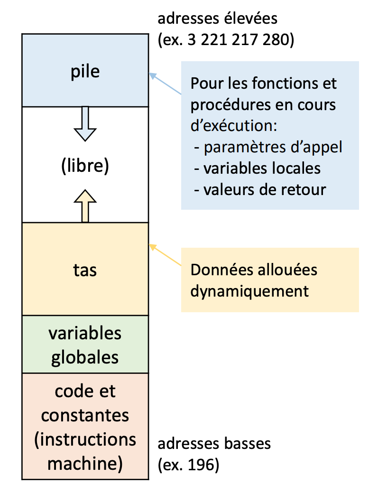

# Introduction

## Pourquoi la gestion de la mémoire est-elle importante dans la programmation C ?

La gestion de la mémoire est un aspect essentiel de la programmation en C, car ce langage donne au programmeur un accès direct à la mémoire de l'ordinateur. La capacité de gérer la mémoire en C est un outil puissant, mais elle nécessite également une attention particulière aux détails. Sans une gestion adéquate de la mémoire, les programmes peuvent se bloquer, se comporter de manière imprévisible ou même présenter un risque pour la sécurité. Il est important de comprendre comment la mémoire est allouée, désallouée et réallouée en C afin d'écrire un code efficace et fiable.


Analogies : Imaginez la mémoire comme une grande boîte à outils avec différents compartiments. Si nous ne gérons pas correctement les outils, nous risquons de les perdre ou d'utiliser accidentellement le mauvais outil, ce qui entraînera un dysfonctionnement dans notre projet.


## Concepts clés de gestion de la mémoire :

### Les différentes zones de mémoire en C

En C, la mémoire est divisée en quatre zones principales : la `pile`, le `tas`, la zone de données et la zone de code. Il est essentiel de comprendre la fonction de chaque zone de mémoire pour gérer efficacement la mémoire en C.

- La **pile** :
La pile est une région de la mémoire où sont stockés les variables locales et les paramètres des fonctions. Elle fonctionne comme une pile d'assiettes dans une cafétéria, où chaque nouvelle assiette est ajoutée au sommet de la pile et où la dernière assiette ajoutée est la première à être retirée. Lorsqu'une fonction est appelée, les paramètres et les variables locales sont placés sur la pile, et lorsque la fonction revient, ils sont retirés de la pile.


- Le **tas** :
Le tas est une région de la mémoire où se produit l'allocation dynamique de la mémoire. Il fonctionne comme une pile de livres dans une bibliothèque, où de nouveaux livres peuvent être ajoutés ou retirés de n'importe quel endroit de la pile. Le tas est utilisé pour allouer dynamiquement de la mémoire au moment de l'exécution, ce qui permet aux programmes d'allouer de la mémoire en fonction des besoins et de la libérer lorsqu'elle n'est plus nécessaire.


- La **zone de données** :
La zone de données est une région de la mémoire où sont stockées les variables globales et statiques. Elle fonctionne comme une armoire dans un bureau, où les fichiers sont stockés pour être facilement accessibles. Les variables globales sont accessibles dans l'ensemble du programme, tandis que les variables statiques ne sont accessibles que dans le fichier où elles sont définies.


- La **zone de code** :
La zone de code est une région de la mémoire où le code exécutable d'un programme est stocké. Elle fonctionne comme un livre de recettes, où sont stockées les instructions de préparation d'un plat. La zone de code est en lecture seule et ne peut pas être modifiée pendant l'exécution du programme.




## Les différents types de données en C et leur taille en mémoire

En informatique, la mémoire est généralement mesurée en octets. Un octet est la plus petite unité de mémoire adressable dans un ordinateur, et se compose généralement de 8 bits. Chaque bit peut avoir une valeur de 0 ou de 1, ce qui permet de représenter des données binaires.


Voici quelques exemples de taille specifique en C:


- **char** :
Une variable char est utilisée pour stocker un seul caractère et a une taille de 1 octet. C'est comme une lettre dans une boîte aux lettres, où vous ne pouvez stocker qu'une seule lettre par boîte aux lettres.


- **int** :
Une variable int est utilisée pour stocker un nombre entier et a une taille de 4 octets sur la plupart des systèmes modernes. C'est comme un sac à dos, dans lequel vous pouvez stocker un certain nombre d'objets en fonction de la taille du sac.


- **float** :
Une variable float est utilisée pour stocker un nombre à virgule flottante et a une taille de 4 octets. C'est comme un verre qui peut contenir une certaine quantité de liquide en fonction de sa taille.


- **double** :
Une variable double est utilisée pour stocker un nombre à virgule flottante en double précision et a une taille de 8 octets. C'est comme un verre plus grand qui peut contenir plus de liquide qu'un verre ordinaire.


### À vous de jouer ! 🤠

1. Exécutez le code ci-dessous qui illustre les différents types de données et leur taille mémoire.

```c
#include <stdio.h>

int main() {
    char lettre = 'A';
    int num = 42;
    float prix = 3.99;
    double pi = 3.14159;
    
    printf("Taille d'un char: %ld octet\n", sizeof(lettre));
    printf("Taille d'un int: %ld octets\n", sizeof(num));
    printf("Taille d'un float: %ld octets\n", sizeof(prix));
    printf("Taille d'un double: %ld octets\n", sizeof(pi));
    
    return 0;
}
```

## Allocation de mémoire statique

### Définition et explications

L'allocation de mémoire statique est une méthode d'attribution de mémoire en langage C, où la taille de la mémoire est déterminée lors de la compilation et ne peut être modifiée pendant l'exécution du programme. Cette méthode d'allocation est utilisée principalement pour les **variables globales**, les **variables locales déclarées** avec le mot-clé `static` et les tableaux **à taille fixe**.

Les variables globales sont déclarées en dehors de toute fonction et sont accessibles à partir de n'importe quelle fonction du programme. Leur durée de vie est la durée d'exécution du programme. Les variables locales avec le mot-clé 'static', en revanche, sont des variables dont la durée de vie est également la durée d'exécution du programme, mais elles ne sont accessibles que dans la fonction où elles sont déclarées.

L'allocation de mémoire statique est réalisée au moment de la compilation, et l'espace mémoire est réservé dans la zone de données du programme. Les variables statiques sont initialisées à zéro par défaut si aucune valeur initiale n'est fournie.

Il est important de noter que l'utilisation de l'allocation de mémoire statique présente certaines limitations. La principale limitation est que la taille de la mémoire allouée doit être connue à l'avance et ne peut être modifiée pendant l'exécution du programme. De plus, l'espace mémoire alloué ne peut pas être libéré avant la fin de l'exécution du programme, ce qui peut entraîner une utilisation inefficace de la mémoire.


Voici un exemple d'allocation statique : 

```c
#include <stdio.h>
int main() {
 static int tableau[5]; // Allocation statique d'un tableau de 5 entiers
 int i;

 for(i = 0; i < 5; i++) {
     tableau[i] = i;
 }

 for(i = 0; i < 5; i++) {
     printf("tableau[%d] = %d\n", i, tableau[i]);
 }

 return 0;
}
```

### Petite analogie

Imaginez que vous êtes en train de construire une maison. L'allocation de mémoire statique est comme la construction des murs, qui sont établis une fois pour toutes et ne peuvent être modifiés une fois qu'ils sont construits. Les dimensions de la maison sont déterminées au moment de la construction, et il n'est pas possible de les changer sans démolir et reconstruire la maison.


###  À vous de jouer !  🤠

**Objectif** : Créer un programme en langage C pour calculer la moyenne de 10 notes d'étudiants en utilisant l'allocation de mémoire statique.

1. Dans un espace de travail propre avec un main de base déclarez un tableau statique de 10 entiers pour stocker les notes.
2. Dans la fonction main, déclarer un tableau statique de 10 entiers pour stocker les notes.
3. Utiliser une boucle for pour demander à l'utilisateur de saisir les 10 notes, puis les stocker dans le tableau.
4. Calculer la somme des notes en utilisant une boucle for.
5. Calculer la moyenne en divisant la somme par le nombre de notes (10).
6. Afficher la moyenne à l'écran.

À la fin de cet exercice, vous devriez être en mesure de comprendre comment allouer de la mémoire statiquement pour stocker des données et comment utiliser des boucles pour accéder à ces données dans un tableau.


## Allocation dynamique de mémoire

### Définition et explication

L'allocation dynamique de mémoire est une méthode d'attribution de mémoire en langage C qui permet d'allouer et de libérer de la mémoire pendant l'exécution du programme. Contrairement à l'allocation de mémoire statique, l'allocation dynamique de mémoire permet de **gérer la taille de la mémoire allouée en fonction des besoins du programme** à l'exécution. Pour cela, le langage C fournit plusieurs fonctions, telles que `malloc()`, `calloc()`, `realloc()` et `free()`.

Les avantages de l'allocation dynamique de mémoire sont la flexibilité, la possibilité de réduire l'utilisation de la mémoire en libérant la mémoire allouée lorsqu'elle n'est plus nécessaire, et la possibilité d'allouer de la mémoire de taille variable.

### Allouer de la mémoire avec malloc

La fonction `malloc()` **alloue un bloc de mémoire de la taille spécifiée** (en octets) et **retourne un pointeur vers le premier octet du bloc alloué**. Si l'allocation échoue, elle retourne `NULL`.

### Syntaxe et exemple d'utilisation

La syntaxe de la fonction `malloc()` est la suivante :

```c
void* malloc(size_t size);
````

La fonction `malloc()` prend un argument, `size`, qui est de type size_t. size_t est un type défini dans la bibliothèque standard (stddef.h) pour représenter des tailles d'objets en mémoire. Généralement, il est défini comme un alias pour un type entier non signé.

`size` représente la taille en octets de la mémoire à allouer. La fonction alloue un bloc de mémoire contigu de la taille spécifiée et **retourne un pointeur générique** (`void*`) vers le début du bloc de mémoire alloué. Si l'allocation échoue (par exemple, si la mémoire est insuffisante), la fonction retourne `NULL`.

Voici un exemple simple d'utilisation de la fonction `malloc()` pour allouer de la mémoire pour un seul entier.


```c
#include <stdio.h>
#include <stdlib.h>

int main() {
    // Création d'un pointeur sur entier
    int *ptr;

    // Allocation de mémoire pour un entier
    ptr = (int*) malloc(sizeof(int));

    if (ptr == NULL) {
        printf("Echec de l'allocation de mémoire.\n");
        return 1;
    }

    // Utilisation de la mémoire allouée
    *ptr = 42;
    
    printf("Valeur de l'entier alloué: %d\n", *ptr);
    
    // Libération de la mémoire
    free(ptr);

    return 0;
}
```

Concentrons nous maintenant sur la ligne la plus importante du programme.

```c
ptr = (int*) malloc(sizeof(int));
```

1. `sizeof(int)` : Calcule la taille en octets d'un entier sur la plate-forme sur laquelle le programme est exécuté. La taille peut varier selon la plate-forme et le compilateur, mais elle est généralement de **4 octets** pour un entier.

2. `malloc(sizeof(int))` : Appelle la fonction `malloc()` avec la taille en octets d'un entier. Cela alloue un bloc de mémoire de la taille requise pour stocker un entier et retourne un pointeur générique (`void*`) vers le début du bloc de mémoire alloué.

3. `(int*) malloc(sizeof(int))` : Convertit le pointeur générique (`void*`) retourné par `malloc()` en un pointeur vers un entier (`int*`). Cette conversion de type est nécessaire car `malloc()` retourne un pointeur générique, et nous devons informer le compilateur que nous allons utiliser ce pointeur pour stocker un entier.

4. `ptr = (int*) malloc(sizeof(int));` : Affecte le pointeur converti à la variable `ptr`. Maintenant, ptr pointe vers un bloc de mémoire alloué dynamiquement, suffisamment grand pour stocker un entier.


### Un autre exemple d'utilisation

```c
#include <stdio.h>
#include <stdlib.h>

int main() {
    int *ptr;
    int n, i;

    printf("Entrez le nombre d'entiers à allouer: ");
    scanf("%d", &n);

    // Allocation de mémoire pour n entiers
    ptr = (int*)malloc(n * sizeof(int));

    if (ptr == NULL) {
        printf("Echec de l'allocation de mémoire.\n");
        return 1;
    }

    // Saisie des entiers
    for (i = 0; i < n; i++) {
        printf("Entrez l'entier %d: ", i + 1);
        scanf("%d", &ptr[i]);
    }

    // Affichage des entiers
    printf("Entiers saisis: ");
    for (i = 0; i < n; i++) {
        printf("%d ", ptr[i]);
    }

    // Libération de la mémoire allouée que nous allons voir plus en détails dans les prochains chapitres
    free(ptr);

    return 0;
}
```

### Petite analogie 

Imaginons que l'allocation de mémoire dynamique avec `malloc` est comme réserver des chambres d'hôtel pour les clients. Chaque client a des besoins spécifiques en termes de nombre de chambres et de taille des chambres.

Lorsqu'un client vient à la réception de l'hôtel et demande un certain nombre de chambres, le réceptionniste (jouant le rôle du **système d'exploitation**) vérifie la disponibilité des chambres dans l'hôtel. Si suffisamment de chambres sont disponibles pour satisfaire la demande du client, le réceptionniste alloue les chambres au client. Dans le cas de malloc, la mémoire disponible de l'ordinateur est l'hôtel et les chambres sont les blocs de mémoire.

La fonction `malloc` prend la taille en octets de la mémoire demandée (comme le nombre de chambres et la taille des chambres) et retourne un pointeur vers le début du bloc de mémoire alloué, si l'allocation réussit (si suffisamment de chambres sont disponibles). Si l'allocation échoue (pas assez de chambres), `malloc` retourne `NULL`.

Dans cette analogie, l'utilisation de `malloc` est comme le processus de demande et d'attribution de chambres d'hôtel en fonction des besoins spécifiques des clients. Une fois que le client a fini d'utiliser les chambres, il doit les libérer (le programme doit libérer la mémoire en utilisant free()), permettant à d'autres clients de les utiliser.


### À vous de jouer ! 🤠
 
Objectif: Créer un programme en langage C pour calculer la somme de n entiers en utilisant l'allocation dynamique de mémoire avec la fonction `malloc()`.


1. Inclure les bibliothèques nécessaires.
    - Inclure la bibliothèque stdio.h.
    - Inclure la bibliothèque stdlib.h.


2. Dans la fonction main, déclarez des variables pour stocker le nombre d'entiers (n) et un pointeur pour stocker les entiers alloués dynamiquement.
    - Déclarer une variable entière `n`.
    - Déclarer un pointeur d'entier `entiers`.


3. Demandez à l'utilisateur de saisir le nombre d'entiers (n) à ajouter.
    - Afficher une invite pour demander le nombre d'entiers.
    - Utiliser `scanf()` pour lire la valeur de `n`.


4. Utilisez la fonction malloc() pour allouer de la mémoire pour stocker n entiers.
    - Allouer la mémoire en multipliant n par la taille d'un entier.
    - Vérifier si l'allocation de mémoire a réussi.


5. Utilisez une boucle for pour demander à l'utilisateur de saisir les n entiers, puis stockez-les dans le bloc de mémoire alloué.
    - Se déplacer de de 0 à n-1.
    - Afficher une invite pour demander un entier.
    - Utiliser `scanf()` pour lire la valeur de l'entier et le stocker à l'adresse du pointeur entiers.


6. Calculez la somme des entiers en utilisant une boucle for.
    - Initialiser une variable pour stocker la somme.
    - Se déplacer de 0 à n-1.
    - Ajouter la valeur de l'entier à la somme.


7. Affichez la somme à l'écran.
    - Utiliser `printf()` pour afficher la somme.


8. Libérez la mémoire allouée en utilisant la fonction free().
    - Appeler la fonction `free()` avec le pointeur entiers.


9. Retourner 0 et terminer le programme.

### Allouer de la mémoire avec calloc

La fonction `calloc()` est utilisée pour allouer de la mémoire dynamique à un tableau d'éléments, initialisant tous les octets à zéro. Contrairement à `malloc()`, qui alloue un bloc de mémoire contigu sans l'initialiser, `calloc()` **garantit** que la **mémoire allouée est initialisée à zéro**.


### Syntaxe et exemple d'utilisation

La syntaxe de la fonction calloc() est la suivante :

```c
void* calloc(size_t count, size_t size);
```


La fonction `calloc()` prend deux arguments: `count`, le nombre d'éléments à allouer, et `size`, la taille en octets de chaque élément. 

La fonction alloue un bloc de mémoire contigu pour contenir count éléments de taille size chacun, initialise tous les octets à zéro, et retourne un pointeur générique (`void*`) vers le début du bloc de mémoire alloué. Si l'allocation échoue, la fonction retourne `NULL`.

Voici un exemple simple pour montrer la différence entre `malloc()` et `calloc()` lors de l'allocation de mémoire pour un seul entier :

```c
#include <stdio.h>
#include <stdlib.h>

int main() {
    int *num_malloc, *num_calloc;

    // Allouer de la mémoire pour un entier avec malloc()
    num_malloc = (int*) malloc(sizeof(int));

    // Allouer de la mémoire pour un entier avec calloc() et initialiser à zéro
    num_calloc = (int*) calloc(1, sizeof(int));

    if (num_malloc == NULL || num_calloc == NULL) {
        printf("Echec de l'allocation de mémoire.\n");
        return 1;
    }

    printf("Valeur de l'entier alloué avec malloc(): %d\n", *num_malloc);
    printf("Valeur de l'entier alloué avec calloc(): %d\n", *num_calloc);

    // Libération de la mémoire allouée
    free(num_malloc);
    free(num_calloc);

    return 0;
}

```

Dans cet exemple, nous avons alloué de la mémoire pour un entier à l'aide de `malloc()` et de `calloc()`. La valeur de l'entier alloué avec `malloc()` sera imprévisible car la mémoire n'est pas initialisée, tandis que la valeur de l'entier alloué avec `calloc()` sera toujours 0 car`calloc()` initialise la mémoire à zéro.


Concentrons nous maintenant sur cette ligne du programme.

```c
num_calloc = (int*) calloc(1, sizeof(int));
```

Dans cette ligne, nous allouons de la mémoire pour un entier en utilisant la fonction `calloc()` et initialisons cette mémoire à zéro. Voici une explication détaillée de chaque partie de la ligne :

- `num_calloc` : Il s'agit d'un pointeur vers un entier (`int*`) qui pointera vers l'adresse de l'entier alloué dynamiquement.
- `calloc(1, sizeof(int))` : Nous appelons la fonction `calloc()` avec deux arguments. Le premier argument 1 indique que nous souhaitons allouer de la mémoire pour un seul élément. Le deuxième argument `sizeof(int)` indique la taille de chaque élément à allouer, qui est la taille d'un entier dans ce cas.
- `(int*)` : Nous effectuons un cast de type pour convertir le pointeur générique (`void*`) renvoyé par `calloc()` en un pointeur vers un entier (`int*`).


En résumé, cette ligne alloue de la mémoire pour un entier, initialise la mémoire allouée à zéro et fait pointer num_calloc vers l'adresse de l'entier alloué.


### Un autre exemple d'utilisation

```c
#include <stdio.h>
#include <stdlib.h>

int main() {
  int nombre_de_cours;
  int *durees_de_cours;
  int nombre_de_tasses = 0;

  printf("Combien de cours avez-vous aujourd'hui ? ");
  scanf("%d", &nombre_de_cours);

  durees_de_cours = (int*) calloc(nombre_de_cours, sizeof(int));
  if (durees_de_cours == NULL) {
    printf("L'allocation de mémoire a échoué\n");
    exit(1);
  }

  for (int i = 0; i < nombre_de_cours; i++) {
    printf("Combien de temps dure le cours %d (en minutes) ? ", i + 1);
    scanf("%d", durees_de_cours + i);
    nombre_de_tasses += *(durees_de_cours + i) / 60 + 1;
  }

  printf("Vous aurez besoin de %d tasses de café pour survivre à cette journée de cours.\n", nombre_de_tasses);

  free(durees_de_cours);

  return 0;
}

```

### Analogie

Imaginons une rangée de casiers dans un vestiaire de salle de sport. Chaque casier représente un bloc de mémoire, et la rangée de casiers représente l'espace de mémoire alloué.

L'utilisation de calloc est comme demander au gérant de la salle de sport de préparer un certain nombre de casiers pour un groupe de sportifs. Le gérant, pour répondre à cette demande, choisit une rangée de casiers vides, les nettoie et les déverrouille. Ainsi, lorsque les sportifs arrivent, ils trouvent des casiers propres et prêts à être utilisés, sans aucun objet ni déchet laissé par les utilisateurs précédents.

Dans le contexte de la programmation, calloc alloue de la mémoire tout en initialisant chaque bloc à zéro, comme les casiers propres et vides dans cette analogie.


### À vous de jouer !  🤠


**Objectif**: Créer un programme qui demande à l'utilisateur le nombre d'articles qu'il a achetés, puis demande le coût de chaque article. Ensuite, le programme calcule le coût total des articles achetés. Nous utiliserons calloc() pour allouer dynamiquement de la mémoire pour stocker les coûts des articles.

1. En partant d'un espace de travail propre, inclure les bibliothèques nécessaires.
    - Inclure la bibliothèque stdio.h.
    - Inclure la bibliothèque stdlib.h.


2. Dans la fonction `main`, déclarez des variables pour stocker le nombre d'articles et un pointeur pour stocker les coûts alloués dynamiquement.
    - Déclarer une variable entière `nombre_articles`.
    - Déclarer un pointeur de type double `couts`.


3. Demander à l'utilisateur combien d'articles ont été achetés et stocker cette valeur dans la variable nombre_articles.
    - Afficher une invite pour demander le nombre d'articles.
    - Utiliser `scanf()` pour lire la valeur de `nombre_articles`.


4. Allouer de la mémoire pour stocker les coûts des articles en utilisant `calloc()` et stocker le pointeur retourné dans la variable `couts`.
    - Allouer la mémoire en multipliant `nombre_articles` par la taille d'un double.
    - Vérifier si l'allocation de mémoire a réussi.


5. Utiliser une boucle for pour récupérer les coûts des articles auprès de l'utilisateur et les stocker dans le tableau alloué précédemment.
    - Se déplacer de 0 à nombre_articles-1.
    - Afficher une invite pour demander le coût d'un article.
    - Utiliser `scanf()` pour lire la valeur du coût et le stocker à l'adresse du pointeur couts.


6. Parcourir le tableau des coûts des articles et additionner les valeurs pour obtenir le coût total.
    - Initialiser une variable pour stocker le coût total.
    - Se déplacer de 0 à nombre_articles-1.
    - Ajouter la valeur du coût de l'article à la variable coût total.


7. Afficher le coût total à l'écran.
    - Utiliser printf() pour afficher le coût total.


8. Libérer la mémoire allouée pour le tableau des coûts des articles à la fin du programme.
    - Appeler la fonction free() avec le pointeur couts.


9. Retourner 0 et terminer le programme.

Maintenant, vous avez un programme complet qui demande le nombre d'articles achetés, récupère les coûts des articles auprès de l'utilisateur, calcule le coût total des articles achetés et libère la mémoire allouée à la fin du programme.


## Désallocation de mémoire
### Définition et explications :
La désallocation de mémoire est le processus par lequel un programme libère la mémoire allouée précédemment lorsqu'elle n'est plus nécessaire. En C, cela se fait en utilisant la fonction `free()`. Libérer la mémoire allouée permet d'éviter les fuites de mémoire et de réutiliser les ressources libérées par le système.

#### Syntaxe de free() et exemple d'utilisation

Syntaxe de `free()` : La syntaxe de la fonction `free()` est la suivante :

```c
void free(void *ptr);
```

La fonction `free()` prend un argument, `ptr`, qui est un pointeur générique (`void*`) pointant vers le bloc de mémoire alloué précédemment par `malloc()`, `calloc()` ou `realloc()`. La mémoire pointée par ptr est libérée et rendue disponible pour d'autres allocations.


### Un exemple d'utilisation

Dans cet exemple simple, nous allons créer un programme qui demande à l'utilisateur de saisir son nom, puis affiche le nom saisi. Le programme alloue de la mémoire pour stocker le nom, puis libère cette mémoire à la fin.

```c
#include <stdio.h>
#include <stdlib.h>
#include <string.h>

int main() {
    char *nom;
    int taille_nom;

    // Demander la taille du nom
    printf("Entrez la taille de votre nom (sans compter le caractère de fin de chaîne) : ");
    scanf("%d", &taille_nom);

    // Allouer de la mémoire pour le nom
    nom = (char*) malloc((taille_nom + 1) * sizeof(char));

    if (nom == NULL) {
        printf("Échec de l'allocation de mémoire.\n");
        return 1;
    }

    // Récupérer le nom saisi par l'utilisateur
    printf("Saisissez votre nom : ");
    scanf("%s", nom);

    // Afficher le nom saisi
    printf("Votre nom est : %s\n", nom);

    // Libérer la mémoire allouée pour le nom
    free(nom);

    return 0;
}

```


Dans cet exemple, nous avons utilisé `malloc()` pour allouer de la mémoire pour stocker le nom saisi par l'utilisateur. Après avoir affiché le nom, nous avons libéré la mémoire allouée en utilisant `free()`. Cet exemple montre comment free() peut être utilisé pour libérer la mémoire allouée lorsqu'elle n'est plus nécessaire.


### Petite analogie

Pensez à la mémoire comme un tableau blanc sur lequel vous écrivez des informations. Lorsque vous avez besoin d'écrire quelque chose de nouveau, vous pouvez effacer certaines parties du tableau pour libérer de l'espace. La fonction free() est similaire à l'action d'effacer une partie du tableau blanc : elle indique au système d'exploitation que l'espace mémoire n'est plus nécessaire et peut être réutilisé.


### À vous de jouer !   🤠

**Objectif**: Nous allons créer un programme qui demande à l'utilisateur d'entrer un certain nombre d'entiers, puis affiche le plus grand et le plus petit nombre parmi ceux saisis. Le programme allouera de la mémoire pour stocker les entiers, puis libérera cette mémoire à la fin.

1. Inclure les bibliothèques nécessaires.
    - Inclure la bibliothèque stdio.h.
    - Inclure la bibliothèque stdlib.h.


2. Dans la fonction `main`, déclarez des variables pour stocker le nombre d'entiers et un pointeur pour stocker les entiers alloués dynamiquement.
    - Déclarer une variable entière nombre_entiers.
    - Déclarer un pointeur d'entier entiers.


3. Demander à l'utilisateur combien d'entiers il souhaite entrer et stocker cette valeur dans la variable nombre_entiers.
    - Afficher une invite pour demander le nombre d'entiers.
    - Utiliser `scanf()` pour lire la valeur de nombre_entiers.


4. Allouer de la mémoire pour stocker les entiers en utilisant malloc().
    - Allouer la mémoire en multipliant nombre_entiers par la taille d'un entier.
    - Vérifier si l'allocation de mémoire a réussi.


5. Utiliser une boucle for pour demander à l'utilisateur de saisir chaque entier. Stocker chaque entier dans le tableau alloué précédemment.
    - Se déplacer de 0 à nombre_entiers-1.
    - Afficher une invite pour demander un entier.
    - Utiliser `scanf()` pour lire la valeur de l'entier et le stocker à l'adresse du pointeur entiers.


6. Initialiser les variables max et min avec la première valeur du tableau.
    - Déclarer deux variables entières max et min.
    - Affecter la première valeur du tableau aux variables max et min.


7. Utilisez une boucle for pour parcourir le tableau d'entiers. La boucle commencera à l'indice 1, puisqu'on a déjà initialisé max et min avec la première valeur du tableau à l'étape 4.
    - Itérer de 1 à nombre_entiers-1.


8. Dans le corps de la boucle for, comparez la valeur actuelle (entiers[i]) avec les valeurs de max et min.
    - Si la valeur actuelle est supérieure à max, mettez à jour max avec cette valeur.
    - Si la valeur actuelle est inférieure à min, mettez à jour min avec cette valeur.


9. Afficher le nombre le plus grand et le plus petit trouvé à l'étape 5.
    - Utiliser `printf()` pour afficher les valeurs de max et min.


10. Libérer la mémoire allouée pour le tableau d'entiers.
    - Appeler la fonction free() avec le pointeur entiers.


11. Retourner 0 et terminer le programme.

## Réallocation de mémoire

### Définition et explications

La réallocation de mémoire est le processus qui permet de modifier la taille d'un bloc de mémoire précédemment alloué. Cela peut être nécessaire si la quantité de mémoire requise pour une structure de données change au cours de l'exécution d'un programme. La fonction `realloc()` est utilisée pour effectuer cette réallocation de mémoire.

### Syntaxe de realloc et exemple d'utilisation

La syntaxe de la fonction `realloc()` est la suivante :

```c
void* realloc(void* ptr, size_t new_size);
```

La fonction `realloc()` prend deux arguments :
- `ptr`, un pointeur vers le bloc de mémoire précédemment alloué
- `new_size`, la nouvelle taille en octets du bloc de mémoire. 

La fonction tente de modifier la taille du bloc de mémoire à laquelle `ptr` pointe, en conservant le contenu existant. 

Si la réallocation réussit, elle retourne un pointeur vers le nouveau bloc de mémoire, qui peut être le même que ptr ou un autre emplacement. Si la réallocation échoue, elle retourne `NULL` et le bloc de mémoire original reste inchangé.

Voici un exemple simple d'utilisation de `realloc()` pour créer un tableau dynamique dont la taille est déterminée par l'utilisateur :

```c
#include <stdio.h>
#include <stdlib.h>

int main() {
    int nombre_elements;
    int *tableau;

    // Demander à l'utilisateur combien d'éléments il souhaite
    printf("Combien d'éléments souhaitez-vous dans le tableau ? ");
    scanf("%d", &nombre_elements);

    // Allouer un tableau initial avec malloc
    tableau = (int*) malloc(nombre_elements * sizeof(int));
    if (tableau == NULL) {
        printf("Échec de l'allocation de mémoire.\n");
        return 1;
    }

    // Remplir le tableau avec des valeurs
    for (int i = 0; i < nombre_elements; i++) {
        tableau[i] = i * 2;
    }

    // Demander à l'utilisateur la nouvelle taille du tableau
    printf("Quelle est la nouvelle taille souhaitée pour le tableau ? ");
    scanf("%d", &nombre_elements);

    // Réallouer la mémoire pour le tableau avec realloc
    int *nouveau_tableau = (int*) realloc(tableau, nombre_elements * sizeof(int));
    if (nouveau_tableau == NULL) {
        printf("Échec de la réallocation de mémoire.\n");
        free(tableau);
        return 1;
    }

    // Assigner le nouveau tableau et remplir les nouveaux éléments si nécessaire
    tableau = nouveau_tableau;
    for (int i = 0; i < nombre_elements; i++) {
        if (tableau[i] == 0) {
            tableau[i] = i * 2;
        }
    }

    // Afficher le tableau redimensionné
    printf("Tableau redimensionné :\n");
    for (int i = 0; i < nombre_elements; i++) {
        printf("tableau[%d] = %d\n", i, tableau[i]);
    }

    // Libérer la mémoire allouée
    free(tableau);
    return 0;
}

```

Dans cet exemple, nous demandons d'abord à l'utilisateur combien d'éléments il souhaite dans le tableau, puis nous allouons un tableau de cette taille. Ensuite, nous remplissons le tableau avec des valeurs, demandons à l'utilisateur la nouvelle taille souhaitée pour le tableau et réallouons la mémoire en conséquence. Si la réallocation réussit, nous remplissons les nouveaux éléments avec des valeurs et affichons le tableau redimensionné. Enfin, nous libérons la mémoire allouée.

### Analogie

Imaginons que vous organisiez une fête dans une salle de banquet. La salle dispose de plusieurs tables pour accueillir les invités. Au début, vous avez réservé suffisamment de tables pour 20 invités. Cependant, vous vous rendez compte que vous devez inviter 10 personnes supplémentaires.

La réallocation de mémoire est comme demander au responsable de la salle de banquet d'ajouter des tables pour accueillir les invités supplémentaires, tout en conservant la disposition actuelle des tables et des sièges. Le responsable peut soit déplacer les tables existantes pour créer de l'espace et ajouter de nouvelles tables, soit étendre certaines des tables existantes pour accueillir plus de sièges. Dans les deux cas, la disposition des tables et des sièges existants reste inchangée, mais la capacité totale de la salle est augmentée pour accueillir les invités supplémentaires.


### À vous de jouer ! 🤠

**Objectif** Nous allons créer un programme qui permet à l'utilisateur d'entrer des entiers dans un tableau redimensionnable.

1. Dans un espace de travail propre, inclure les bibliothèques nécessaires.
    - Inclure la bibliothèque stdio.h.
    - Inclure la bibliothèque stdlib.h.


2. Déclarez les variables principales dans la fonction main.
    - Déclarer une variable entière `nombre_elements` et l'initialiser à 0.
    - Déclarer un pointeur d'entier `tableau` et initialiser à `NULL`.
    - Déclarer une variable entière `entree`.


3. Créez une boucle while qui vérifie si la variable entree est différente de -1.
    - Utiliser une condition while (entree != -1).


4. À l'intérieur de la boucle, utilisez `printf()` pour afficher une invite demandant à l'utilisateur d'entrer un entier.


5. Utilisez `scanf()` pour lire l'entier saisi par l'utilisateur et le stocker dans la variable entree.


6. Vérifiez si l'utilisateur a saisi -1 avec une instruction if. Si c'est le cas, exécutez une instruction break pour sortir de la boucle.


7. Utilisez la fonction `realloc()` pour réallouer de la mémoire au tableau, en calculant la nouvelle taille avec `(nombre_elements + 1) * sizeof(int)`.
    - Déclarer un pointeur d'entier `nouveau_tableau`.
    - Utiliser `realloc()` et assigner le résultat à `nouveau_tableau`.


8. Vérifiez si la réallocation a réussi en examinant si nouveau_tableau est égal à NULL.
    - Utiliser une instruction if pour vérifier si nouveau_tableau est égal à NULL.
    - Si c'est le cas, libérez la mémoire précédemment allouée avec free(tableau) et terminez le programme avec un code de retour non nul (return 1).


9. Mettez à jour le pointeur tableau pour qu'il pointe vers le nouveau bloc de mémoire.
    - Assigner nouveau_tableau à tableau.


10. Ajoutez l'entier saisi à la fin du tableau.
    - Assigner la valeur de entree à l'index nombre_elements du tableau.


11. Ajouter 1 à la variable nombre_elements.


12. À la fin de la boucle, créez une boucle for qui commence avec un indice i égal à 0 et se poursuit jusqu'à ce que i atteigne nombre_elements, exclu.
    - Utiliser une condition` for (int i = 0; i < nombre_elements; i++)`.
    
13. À chaque pas de la boucle, utilisez `printf()` pour afficher l'index du tableau (la variable i) et la va## Erreurs courantes dans la gestion de la mémoire

Les développeurs commettent souvent des erreurs, ce qui peut entraîner des problèmes ou des erreurs liées à la mémoire dans un programme. Dans ce cours, nous discuterons de trois erreurs courantes dans la gestion de la mémoire : les fuites de mémoire, les pointeurs en suspension et l'utilisation de mémoire non initialisée.

### Fuites de mémoire

Une fuite de mémoire se produit lorsqu'un programme alloue de la mémoire mais ne la libère pas une fois qu'elle n'est plus nécessaire. Cela entraîne une augmentation de l'utilisation de la mémoire au fil du temps, ce qui peut amener un programme à consommer de plus en plus de ressources mémoire et finalement provoquer un plantage ou un ralentissement des performances.

#### Exemple d'illustration

```c
#include <stdio.h>
#include <stdlib.h>

void fonction_fuite() {
    int *pointeur = (int *) malloc(10 * sizeof(int));
    // La mémoire allouée n'est jamais libérée
}

int main() {
    for (int i = 0; i < 1000; i++) {
        fonction_fuite();
    }
    printf("Fuites de mémoire produites.\n");
    return 0;
}
```


#### Analogie

Imaginons que vous organisiez une fête et que vous distribuiez des verres en plastique à chaque invité. À mesure que la fête avance, les invités jettent leurs verres usagés dans un bac à recycler. Cependant, si vous oubliez de vider ce bac régulièrement, les verres s'accumulent, et il devient de plus en plus difficile pour les invités de jeter leurs verres usagés. Cette situation est similaire à une fuite de mémoire dans un programme : la mémoire allouée s'accumule sans être libérée, provoquant une consommation croissante de ressources.


### Pointeurs en suspension

Un pointeur en suspension est un pointeur qui pointe vers un bloc de mémoire qui a été libéré ou qui n'est plus valide. L'utilisation de pointeurs en suspension peut entraîner des comportements imprévisibles, des plantages ou des problèmes de sécurité.


#### Exemple d'illustration

```c
#include <stdio.h>
#include <stdlib.h>

int main() {
    int *pointeur = (int *) malloc(10 * sizeof(int));
    free(pointeur); // Libération de la mémoire

    // Le pointeur est maintenant en suspension
    printf("Valeur du pointeur en suspension: %d\n", *pointeur);

    return 0;
}

```

#### Analogie

Imaginez une situation où vous avez une liste de contacts et que chaque contact est représenté par une carte. Vous décidez de supprimer un contact en jetant sa carte. Cependant, vous oubliez de mettre à jour l'adresse de cette carte dans votre carnet d'adresses. La prochaine fois que vous essayez de contacter cette personne, vous cherchez dans votre carnet d'adresses, mais l'adresse est obsolète, et vous ne pouvez pas atteindre cette personne. Cette situation est similaire à un pointeur en suspension : le pointeur pointe vers une mémoire qui n'est plus valide, ce qui entraîne des erreurs ou des problèmes de sécurité.


### Utilisation de mémoire non initialisée

L'utilisation de mémoire non initialisée se produit lorsqu'un programme tente d'accéder à une zone de mémoire qui n'a pas été initialisée avec une valeur valide. Cela peut entraîner des comportements imprévisibles, des erreurs ou des problèmes de sécurité.

#### Exemple d'illustration

```c
#include <stdio.h>
#include <stdlib.h>

int main() {
    int *pointeur = (int *) malloc(10 * sizeof(int));
    // La mémoire allouée n'est pas initialisée

    // Accès à la mémoire non initialisée
    printf("Valeur de la mémoire non initialisée: %d\n", pointeur[5]);

    free(pointeur);
    return 0;
}
```

#### Analogie

Prenons l'exemple d'un professeur qui distribue des feuilles de calcul à ses élèves pour qu'ils résolvent des problèmes de mathématiques. Chaque élève doit résoudre les problèmes et écrire les réponses sur la feuille de calcul. Cependant, le professeur oublie de distribuer des feuilles de calcul à certains élèves. 

Ces élèves n'ont pas de feuille sur laquelle écrire leurs réponses, et ils ne savent pas quelles questions résoudre. Cette situation est similaire à l'utilisation de mémoire non initialisée : le programme tente d'accéder à une zone de mémoire qui n'a pas été initialisée avec une valeur valide, entraînant des erreurs ou des problèmes de sécurité.
leur stockée à cet index (`tableau[i]`).

14. Libérer la mémoire allouée et terminer le programme.
    - Utiliser `free(tableau)` pour libérer la mémoire.


## Erreurs courantes dans la gestion de la mémoire

Les développeurs commettent souvent des erreurs, ce qui peut entraîner des problèmes ou des erreurs liées à la mémoire dans un programme. Dans ce cours, nous discuterons de trois erreurs courantes dans la gestion de la mémoire : les fuites de mémoire, les pointeurs en suspension et l'utilisation de mémoire non initialisée.

### Fuites de mémoire

Une fuite de mémoire se produit lorsqu'un programme alloue de la mémoire mais ne la libère pas une fois qu'elle n'est plus nécessaire. Cela entraîne une augmentation de l'utilisation de la mémoire au fil du temps, ce qui peut amener un programme à consommer de plus en plus de ressources mémoire et finalement provoquer un plantage ou un ralentissement des performances.

#### Exemple d'illustration

```c
#include <stdio.h>
#include <stdlib.h>

void fonction_fuite() {
    int *pointeur = (int *) malloc(10 * sizeof(int));
    // La mémoire allouée n'est jamais libérée
}

int main() {
    for (int i = 0; i < 1000; i++) {
        fonction_fuite();
    }
    printf("Fuites de mémoire produites.\n");
    return 0;
}
```


#### Analogie

Imaginons que vous organisiez une fête et que vous distribuiez des verres en plastique à chaque invité. À mesure que la fête avance, les invités jettent leurs verres usagés dans un bac à recycler. Cependant, si vous oubliez de vider ce bac régulièrement, les verres s'accumulent, et il devient de plus en plus difficile pour les invités de jeter leurs verres usagés. Cette situation est similaire à une fuite de mémoire dans un programme : la mémoire allouée s'accumule sans être libérée, provoquant une consommation croissante de ressources.


### Pointeurs en suspension

Un pointeur en suspension est un pointeur qui pointe vers un bloc de mémoire qui a été libéré ou qui n'est plus valide. L'utilisation de pointeurs en suspension peut entraîner des comportements imprévisibles, des plantages ou des problèmes de sécurité.


#### Exemple d'illustration

```c
#include <stdio.h>
#include <stdlib.h>

int main() {
    int *pointeur = (int *) malloc(10 * sizeof(int));
    free(pointeur); // Libération de la mémoire

    // Le pointeur est maintenant en suspension
    printf("Valeur du pointeur en suspension: %d\n", *pointeur);

    return 0;
}

```

#### Analogie

Imaginez une situation où vous avez une liste de contacts et que chaque contact est représenté par une carte. Vous décidez de supprimer un contact en jetant sa carte. Cependant, vous oubliez de mettre à jour l'adresse de cette carte dans votre carnet d'adresses. La prochaine fois que vous essayez de contacter cette personne, vous cherchez dans votre carnet d'adresses, mais l'adresse est obsolète, et vous ne pouvez pas atteindre cette personne. Cette situation est similaire à un pointeur en suspension : le pointeur pointe vers une mémoire qui n'est plus valide, ce qui entraîne des erreurs ou des problèmes de sécurité.


### Utilisation de mémoire non initialisée

L'utilisation de mémoire non initialisée se produit lorsqu'un programme tente d'accéder à une zone de mémoire qui n'a pas été initialisée avec une valeur valide. Cela peut entraîner des comportements imprévisibles, des erreurs ou des problèmes de sécurité.

#### Exemple d'illustration

```c
#include <stdio.h>
#include <stdlib.h>

int main() {
    int *pointeur = (int *) malloc(10 * sizeof(int));
    // La mémoire allouée n'est pas initialisée

    // Accès à la mémoire non initialisée
    printf("Valeur de la mémoire non initialisée: %d\n", pointeur[5]);

    free(pointeur);
    return 0;
}
```

#### Analogie

Prenons l'exemple d'un professeur qui distribue des feuilles de calcul à ses élèves pour qu'ils résolvent des problèmes de mathématiques. Chaque élève doit résoudre les problèmes et écrire les réponses sur la feuille de calcul. Cependant, le professeur oublie de distribuer des feuilles de calcul à certains élèves. 

Ces élèves n'ont pas de feuille sur laquelle écrire leurs réponses, et ils ne savent pas quelles questions résoudre. Cette situation est similaire à l'utilisation de mémoire non initialisée : le programme tente d'accéder à une zone de mémoire qui n'a pas été initialisée avec une valeur valide, entraînant des erreurs ou des problèmes de sécurité.
