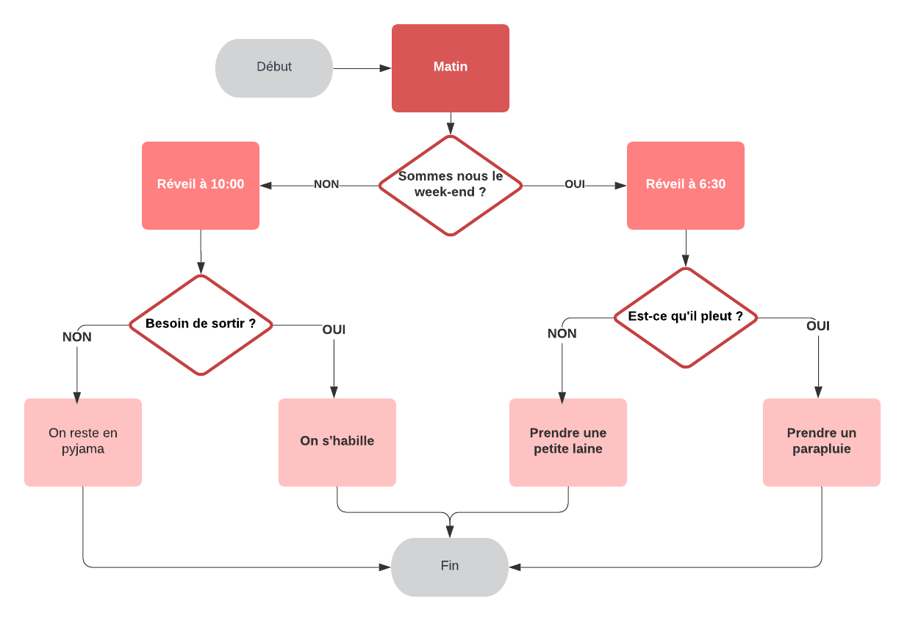

# Introduction aux instructions conditionnelles

Imaginez que vous vous réveillez le matin.

Vous vous réveillez et vous vous dites : "Ugh. C'est un jour de semaine ?"

Si oui, vous devez vous lever, vous habiller et vous préparer pour l'université. Si ce n'est pas le cas, vous pouvez faire la grasse matinée un peu plus longtemps et attraper quelques heures supplémentaires.

Mais hélas, c'est un jour de semaine, alors vous êtes debout et habillé et vous allez regarder dehors, "Quel temps fait-il ? Ai-je besoin d'un parapluie ?"



Ces **questions et décisions contrôlent le déroulement** de votre matinée, chaque étape et résultat est un produit des conditions du jour et de votre environnement.


 Votre ordinateur, tout comme vous, passe par un **flux similaire chaque fois qu'il exécute un code**. Un programme s'exécute (se réveille) et commence à passer par ses listes de contrôle, est-ce que telle ou telle condition est remplie, est-ce que telle ou telle condition est remplie, exécutons ce code et renvoyons cette valeur.

C'est le flux de contrôle de votre programme. En C++, votre script s'exécutera de haut en bas, jusqu'à ce qu'il n'y ait plus rien à exécuter. C'est à vous d'inclure des passerelles, appelées **instructions conditionnelles**, pour indiquer à l'ordinateur quand il doit exécuter certains blocs de code. Si ces conditions sont remplies, alors exécutez cette fonction.

# Déclaration Si ou if

Une instruction if est utilisée pour tester la véracité d'une expression et exécuter du code en fonction de celle-ci. Voici une forme simple de l'instruction if :

```
if (condition) {

  code à exécuter

}
```

Si la condition est égale à `true` (🇫🇷 vrai), les instructions qu'elle contient sont exécutées. Sinon, les instructions sont ignorées et le programme continue.


```cpp
if (montant_compte == 0) {
  printf("J'ai plus un radis 😭😭\n");
}
```

Le mot-clé `if` est suivi d'un ensemble de parenthèses `()`.

À l'intérieur des parenthèses `()`, une condition est fournie et évaluée à `true` ou `false` :

Si la condition est vraie, le code à l'intérieur des accolades `{}` est exécuté.
Si la condition vaut faux, le code ne s'exécute pas.
Ainsi, dans le code ci-dessus, si `montant_compte` est égal à 0, le programme affiche "J'ai plus un radis 😭😭" ; dans le cas contraire, rien ne se passe et le programme continue son exécution.

## A vous de jouer ! 🧩 🎮

### Mise en place

1. Récupérer le squelette de la fonction avec sa bibliothèque.
    ```c
    #include <stdio.h>

    int main()
    {
        // Votre code ci-dessous

        return 0;
    }
    ```

2. Créez une variable entière `note_programmation` et assignez la à 12.

3. À la suite, crivez une instruction `if` où si `note_programmation < 9` est vrai, on affiche `" Note insuffisante"`.
  <details>
  <summary>J'ai besoin d'aide ! 😱</summary>
  <p>

  Le modèle de l'instruction `if` est le suivant :

  ```c
  if (condition) {

    // code

  }
  ```

  ```cpp
  if (note_programmation > 10) {

    printf("Note suffisante\n");

  }
  ```

  </p>
  </details>

  # Les opérateurs relationnels

Lorsque nous écrivons des instructions conditionnelles, nous devons parfois utiliser différents types d'opérateurs pour comparer des valeurs. Ces opérateurs sont appelés opérateurs relationnels.

Pour avoir une condition, nous avons besoin d'opérateurs relationnels :

- `==` égal à
- `!=` non égal à
- `>` supérieur à
- `<` inférieur à
- `>=` supérieur ou égal à
- `<=` inférieur ou égal à

Les opérateurs relationnels comparent la valeur de gauche avec la valeur de droite.

## A vous de jouer ! 🧩 🎮

1. Reprendre le code à l'exercice précédent.


2. Changez la condition `note_programmation > 10` en  `note_programmation < 10`.
Que pensez-vous qu'il va se passer ?

  <details>
  <summary>J'ai besoin d'aide ! 😱</summary>
  <p>Le code devrait maintenant ressembler à ceci :</P

  ```c
  if (note_programmation < 10) {

    printf("Note Insuffisante\n");

  }
  ```

  Mais rien ne s'est passé !

  Oui, la note en programmation est égale à 12, ce qui signifie que note_programmation < 10, la condition, est fausse. Parce que la condition est fausse, le code à l'intérieur ne s'exécutera pas.

  </p>
  </details>


3. Changez la condition `note_programmation < 10` en `note_programmation != 10`.
    À votre avis, que se passera-t-il ?
      <details>
      <summary>J'ai besoin d'aide ! 😱</summary>
      <p>

      Le code devrait maintenant ressembler à ceci :

      ```cpp
      if (note_programmation != 10) {

        printf("Note Suffisante\n");

      }
      ```

      Note Suffisante est affiché !

      La note est égale à 12, ce qui signifie que note != 10, la condition, est vraie. Parce que la condition est vraie, le code à l'intérieur s'exécutera !

      </p>
      </details>

    <br>


    # Instruction Sinon

Nous pouvons également ajouter une clause else (🇫🇷 sinon) à une instruction if pour fournir un code qui ne sera **exécuté que si la condition est fausse**. Voici une forme d'instruction if qui inclut une clause else :

```
if (condition) {

  // Instruction 1
  faire quelque chose

} else {
  // Instruction 2
  faire une autre chose

}
```

- Si la condition est `true` (vraie), l'instruction 1 est exécutée. Ensuite, le programme ignore l'instruction 2 et exécute toutes les instructions de code qui suivent la clause if/else.

- Si la condition est `false` (fausse), l'instruction 1 est ignorée et l'instruction 2 est exécutée. Une fois l'instruction 2 terminée, le programme exécute toutes les instructions de code qui suivent la clause if/else.

```cpp
if (cote_piece == 0) {

  printf("Pile\n");

}
else {

  printf("Face\n");

}
```

Ainsi, dans le code ci-dessus, si la pièce est égale à 0, le programme affiche `Pile` ; dans le cas contraire, il affiche `Face`.

*Remarque : c'est soit l'un soit l'autre - seul l'un des deux s'exécutera !*

## A vous de jouer ! 🧩 🎮

1. Créer un nouveau programme.


2. À la première ligne, inclure la bibliothèque de base pour pouvoir entrer les entrées & sorties.

  <details>
  <summary>J'ai besoin d'aide ! 😱</summary>
  <p>

  ```cpp
  #include <stdio.h>
  ```
  </p>
  </details>


3. Créez à la suite la fonction principale avec ses accolades.
  <details>
  <summary>J'ai besoin d'aide ! 😱</summary>
  <p>

  ```cpp
  int main() {

   // Votre code ci-dessous entre les accolades

  }
  ```

  </p>
  </details>


4. Déclarez et initialisée une variable entière `nombre_a_tester` initialisée à 8.
  <details>
  <summary>J'ai besoin d'aide ! 😱</summary>
  <p>

  ```cpp
  int nombre_a_tester = 8;
  ```

  </p>
  </details>


5. Ecrivez une **instruction if** où si le reste de la division euclidienne est égale à 0 ou (`nombre_a_tester % 2 == 0`) est vrai, on affiche `" Le nombre est pair"`.
  <details>
  <summary>J'ai besoin d'aide ! 😱</summary>
  <p>

  Le modèle de l'instruction `if` est le suivant :

  ```cpp
  if (condition) {

    // code

  }
  ```
  Ce qui nous donne

  ```cpp
  if (nombre_a_tester % 2 == 0) {

    printf("Le nombre est pair.\n");

  }
  ```

  </p>
  </details>


6. Ajoutez une **instruction else** qui affiche à l'utilisateur `"Le nombre est impair"`.

# Else if ou "sinon si"

Que se passe-t-il donc si vous voulez plus de deux résultats possibles ?

C'est là que l'option d'une autre alternative entre en jeu !

```c
if (condition1) {

  // code à exécuter pour la condition 1

} else if (condition2) {

  // code à exécuter pour la condition 2

} else {

  // code à exécuter si aucune conditions n'est remplie

}
```

L'instruction `else if` vient toujours après l'instruction `if` et avant l'instruction `else`. L'instruction `else if` prend également une condition.

Et vous pouvez en avoir plusieurs ! Voici un exemple avec trois d'entre elles :

```cpp
if (age == 1) {

  printf("Bébé\n");

}
else if (age == 5) {

  printf("Enfant\n");

}
else if (age == 12) {

  printf("Adolescent\n");

}
else if (age == 18) {

  printf("Adulte\n");

}
else {

  printf("Senior\n");

}
```

## A vous de jouer ! 🧩 🎮

1. Partir sur un nouveau brouillon.

2. À la première ligne, inclure la bibliothèque de base pour les entrées & sorties.

  <details>
  <summary>J'ai besoin d'aide ! 😱</summary>
  <p>

  ```cpp
  #include <stdio.h>
  ```
  </p>
  </details>


3. Créez à la suite la fonction principale avec ses accolades.
  <details>
  <summary>J'ai besoin d'aide ! 😱</summary>
  <p>

  ```cpp
  int main() {

   // Votre code ci-dessous entre les accolades

  }
  ```

  </p>
  </details>


4. Déclarez et initialisée une variable flottante `ph` initialisée à `4.8`.

  <details>
  <summary>J'ai besoin d'aide ! 😱</summary>
  <p>

  ```cpp
  double ph = 4.8;
  ```

  </p>
  </details>

En chimie, le pH est une échelle utilisée pour spécifier l'acidité ou la basicité d'une solution aqueuse.

5. Écrivez des instructions conditionnelles **if, else if, else** pour les conditions suivantes:
 - Si le `ph est supérieur à 7`, on affiche  `"Solution basique"`.
 - Si le `ph est inférieur à 7`, le résultat est `"Solution acide"`.
 - Si ni l'un ni l'autre n'est atteint, le résultat est `"Solution neutre"`.

   <details>
   <summary>J'ai besoin d'aide ! 😱</summary>
   <p>

     ```cpp
     #include <stdio.h>

    int main() {

      double ph = 4.8;

      if (ph > 7) {

        printf("Solution basique\n");

      }
      else if (ph < 7) {

        printf("Solution acide\n");

      }
      else {

        printf("Solution neutre\n");

      }  

    }
     ```

   </p>
   </details>

   # Instruction d'aiguillage, commutateur ou switch

   Maintenant que nous savons comment fonctionnent les expressions `if`, `else if`, `else`, nous pouvons écrire des programmes qui ont plusieurs issues. Les programmes à issues multiples sont si courants que le C++ fournit une instruction spéciale pour cela... l'instruction `switch` !

   Une instruction `switch` fournit une syntaxe alternative plus facile à lire et à écrire. Cependant, vous les trouverez moins souvent que les instructions `if`, `else if`, `else` dans la nature.

   Une instruction switch ressemble à ceci :

   ```cpp
   int jour = 5;
   switch (jour) {
     case 1:
       printf("Lundi");
       break;
     case 2:
       printf("Mardi");
       break;
     case 3:
       printf("Mercredi");
       break;
     case 4:
       printf("Jeudi");
       break;
     case 5:
       printf("Vendredi");
       break;
     case 6:
       printf("Samedi");
       break;
     case 7:
       printf("Dimanche");
       break;
   }

   // Affiche "Vendredi" (jour 5)
   ```

   - Le mot-clé `switch` initie l'instruction et est suivi de `()`, qui contient la valeur qui sera comparée dans chaque cas.

    Dans l'exemple, la valeur ou l'expression de l'instruction `switch` est `jour`. Une des restrictions de cette expression est qu'elle doit être évaluée par un type intégral (`int`, `char`, `short`, `long`, `long long`, ou `enum`) c'est à dire qui peut être représenté sous la forme d'un entier.

   - À l'intérieur du bloc représenté par `{}`, il y a plusieurs cas.

   - Le mot-clé `case` vérifie si l'expression correspond à la valeur spécifiée qui la suit. La valeur qui suit le premier cas est `1`. Si la valeur de `jour` est égale à `1`, alors le code qui suit le : sera exécuté.

   - Le mot-clé `break` indique à l'ordinateur de sortir du bloc et de ne plus exécuter de code ni vérifier d'autres cas à l'intérieur du bloc de code.

   - À la fin de chaque instruction `switch`, il y a une instruction `default`. Si aucun des cas n'est vrai, le code de l'instruction par défaut sera exécuté.


   **Remarque** : sans le mot clé `break` à la fin de chaque cas, le programme **exécute le code du premier cas correspondant et tous les cas suivants**, y compris le code par défaut. Ce comportement est différent des instructions conditionnelles if / else qui n'exécutent qu'un seul bloc de code.

   ## A vous de jouer ! 🧩 🎮

   La SNCF vous recrute pour faire un petit programme pour aiguiller les prochains départs de train en fonction de leur numéro d'identification.

   1. Créez un nouveau programme vierge.


   2. À la première ligne, inclure la bibliothèque de base pour les entrées & sorties.

     <details>
     <summary>J'ai besoin d'aide ! 😱</summary>
     <p>

     ```cpp
     #include <stdio.h>
     ```
     </p>
     </details>


   3. Créez à la suite la fonction principale avec ses accolades.
     <details>
     <summary>J'ai besoin d'aide ! 😱</summary>
     <p>

     ```cpp
     int main() {

      // Votre code ci-dessous entre les accolades

     }
     ```

     </p>
     </details>


   4. Créez une variable entière `id_train` et initialisée la à `889415`.

     <details>
     <summary>J'ai besoin d'aide ! 😱</summary>
     <p>

     ```cpp
     int id_train = 889415;
     ```

     </p>
     </details>


   5. Créez une instruction switch pour id_train avec 3 cas:
     - cas `5103` afficher `"Destination MARSEILLE"`
     - cas `6603` afficher `"Destination PERRACHE"`
     - le cas par défault  afficher `"Destination GRENOBLE"`

     <details>
     <summary>J'ai besoin d'aide ! 😱</summary>
     <p>

     ```cpp
     switch(id_train) {
     case 5103:
       printf("Destination MARSEILLE\n");
       break;
     case 6603:
       printf("Destination PERRACHE\n");
       break;
     default:
       printf("Destination GRENOBLE\n");
     }
     ```

     </p>
     </details>


   6. Compilez et exécutez le code une première fois pour vous assurer qu'il n'y a pas de bug !


   7. Ajoutons 1 cas supplémentaire juste avant le cas par défaut :
     - cas `889415` pour afficher `"Destination ROANNE"`

       <details>
       <summary>J'ai besoin d'aide ! 😱</summary>
       <p>

       ```cpp
       switch(id_train) {
       case 5103:
         printf("Destination MARSEILLE\n");
         break;
       case 6603:
         printf("Destination PERRACHE\n");
         break;
       case 889415:
         printf("Destination ROANNE\n");
         break;
       default:
         printf("Destination GRENOBLE\n");
       }
       ```

       </p>
       </details>


   8. Compilez et exécutez le code à nouveau pour vous assurer qu'il n'y a pas de bug !


   # Introduction aux opérateurs logiques
Souvent, lorsque nous essayons de créer un flux d'instructions conditionnelles pour notre programme, nous rencontrons des situations où la logique ne peut être satisfaite par une seule condition.

Les opérateurs logiques sont utilisés pour **combiner deux ou plusieurs conditions**. Ils permettent aux programmes de prendre des décisions plus souples. Le résultat de l'opération d'un opérateur logique est une valeur `bool`, soit **vrai** ou **faux**.

Nous allons aborder trois opérateurs logiques :

- `&&`: l'opérateur logique **et**
- `||`: l'opérateur logique **ou**
- `!` : l'opérateur logique **non**

## Table ET (&&)

| a    | b    | a && b |
|------|------|--------|
| faux | faux | faux   |
| faux | vrai | faux   |
| vrai | faux | faux   |
| vrai | vrai | vrai   |

Comme on peut le voir dans cet opérateur nous avons besoin des 2 opérandes à vrai pour que le résultat soit vrai.

## Table OU (||)

| a    | b    | a \|\| b |
|------|------|----------|
| faux | faux | faux     |
| faux | vrai | vrai     |
| vrai | faux | vrai     |
| vrai | vrai | vrai     |

Contrairement au précédent opérateur seul 1 des 2 suffit à rendre notre résultat vrai.


## Table NON (!)

| a    | -a   |
|------|------|
| faux | vrai |
| vrai | faux |

👉 [Pour plus d'informations sur les opérateurs et l'algèbre de Boole](https://fr.wikipedia.org/wiki/Alg%C3%A8bre_de_Boole_(logique))


# Opérateur logique et : &&

L'opérateur logique et est désigné par `&&`.

Il renvoie vrai si la **condition de gauche et la condition de droite sont toutes deux vraies**. **Sinon**, il renvoie un résultat **faux**.

Voici sa table de vérité :

| a    | b    | a && b |
|------|------|--------|
| faux | faux | faux   |
| faux | vrai | faux   |
| vrai | faux | faux   |
| vrai | vrai | vrai   |

Par exemple :

( `1 < 2 && 2 < 3` ) renvoie **vrai**
( `1 < 2 && 2 > 3` ) renvoie **faux**


## A vous de jouer ! 🧩 🎮

1. Créez un nouveau espace de travail vierge.

2. À la première ligne, inclure la bibliothèque de base pour les entrées & sorties.

  <details>
  <summary>J'ai besoin d'aide ! 😱</summary>
  <p>

  ```cpp
  #include <stdio.h>
  ```
  </p>
  </details>


3. Créez à la suite la fonction principale avec ses accolades.
  <details>
  <summary>J'ai besoin d'aide ! 😱</summary>
  <p>

  ```cpp
  int main() {

   // Votre code ci-dessous entre les accolades

   return 0;
  }
  ```

  </p>
  </details>


4. Déclarez et initialisez 2 variables entières `bien_bu`, `bien_mange` à 1.

  <details>
  <summary>J'ai besoin d'aide ! 😱</summary>
  <p>

  ```cpp
  int bien_bu, bien_mange = 1;
  ```

  </p>
  </details>


5. Écrivez à la suite l'instruction `if` suivante :

  Si `bien_bu` est vraie et que `bien_mange` est vraie, alors affichez le mot "J'ai la peau du ventre bien tendu".

  <details>
  <summary>J'ai besoin d'aide ! 😱</summary>
  <p>

  Le signe `et` en C est écrit avec `&&`.

  ```cpp
  if (bien_bu == 1 && bien_mange == 1) {

    printf("J'ai la peau du ventre bien tendu\n");

  }
  ```

  </p>
  </details>


6. Compilez et exécutez le code pour vous assurer qu'il n'y a pas de bug !


# Opérateur logique ou : ||

L'opérateur logique ou est désigné par `||`.

Il renvoie vrai lorsque la **condition de gauche est vraie ou lorsque la condition de droite est vraie**. Une seule des deux conditions doit être vraie.

Voici sa table de vérité :

## Table OU (||)

| a    | b    | a \|\| b |
|------|------|----------|
| faux | faux | faux     |
| faux | vrai | vrai     |
| vrai | faux | vrai     |
| vrai | vrai | vrai     |

Par exemple :

( `1 < 2 || 2 > 3` ) **renvoie vrai**
( `1 > 2 || 2 > 3` ) **renvoie faux**


## A vous de jouer ! 🧩 🎮

1. Créez un nouvel espace de travail vierge.

2. À la première ligne, inclure la bibliothèque de base pour les entrées & sorties.

  <details>
  <summary>J'ai besoin d'aide ! 😱</summary>
  <p>

  ```cpp
  #include <stdio.h>
  ```
  </p>
  </details>


3. Créez à la suite la fonction principale avec ses accolades.
  <details>
  <summary>J'ai besoin d'aide ! 😱</summary>
  <p>

  ```cpp
  int main() {

   // Votre code ci-dessous entre les accolades

     return 0;
  }
  ```

  </p>
  </details>


4. Déclarez et initialisez 1 variables entières `jour_semaine` à `7`.

  <details>
  <summary>J'ai besoin d'aide ! 😱</summary>
  <p>

  ```cpp
  int jour_semaine = 7;
  ```

  </p>
  </details>


5. Écrivez à la suite l'instruction `if` suivante :

  Si le jour de la semaine est égal à 6 ou le jour est égal à 7, alors on affiche sur la console "C'est le Week-End !!".

    <details>
    <summary>J'ai besoin d'aide ! 😱</summary>
    <p>

    Le signe `ou` de C est écrit avec `||` ou le mot clé `or`.

    ```cpp
    if (jour_semaine == 6 || jour_semaine == 7) {

      printf("C'est le Week-End !!\n");

    }
    ```

    </p>
    </details>


6. Compilez et exécutez le code pour vous assurer qu'il n'y a pas de bug !

# Opérateur logique non : !

L'opérateur `non` logique est désigné par le symbole `!`.

Il inverse le résultat bool de l'expression qui suit immédiatement.

Voici sa table de vérité :

## Table NON (!)

| a    | -a   |
|------|------|
| faux | vrai |
| vrai | faux |

Par exemple :

( `!true` ) renvoie `false`
( `!false` ) renvoie à `true`
( `!(10 < 11)` ) renvoie `false`


## A vous de jouer ! 🧩 🎮

1. Créez un espace de travail vierge.

2. À la première ligne, inclure la bibliothèque de base pour les entrées & sorties.

  <details>
  <summary>J'ai besoin d'aide ! 😱</summary>
  <p>

  ```cpp
  #include <stdio.h>
  ```
  </p>
  </details>


3. Créez à la suite la fonction principale avec ses accolades.
  <details>
  <summary>J'ai besoin d'aide ! 😱</summary>
  <p>

  ```cpp
  int main() {

   // Votre code ci-dessous entre les accolades
   return 0;
  }
  ```

  </p>
  </details>


4. Déclarez et initialisez 1 variables entières `mot_de_passe_saisi` à `false`.

  <details>
  <summary>J'ai besoin d'aide ! 😱</summary>
  <p>

  ```cpp
  int mot_de_passe_saisi = 0;
  ```

  </p>
  </details>


5. Écrivez à la suite l'instruction `if` suivante :

  Si le mot de passe n'est pas saisi alors on affiche sur la console du terminal `"Veuillez saisir le mot de passe"`.

  <details>
  <summary>J'ai besoin d'aide ! 😱</summary>
  <p>


  ```cpp
  if (!mot_de_passe_saisi) {

    printf("Veuillez saisir le mot de passe\n");

  }
  ```

  </p>
  </details>


6. Compilez et exécutez le code pour vous assurer qu'il n'y a pas de bug !

## Opérateurs ternaires

Nous avons appris que l'instruction if / else est polyvalente. Elle est si polyvalente que le C dispose d'un moyen spécial intégré pour raccourcir une instruction if / else en une seule ligne. Et vous n'avez même pas besoin d'utiliser les mots "if" et "else" !

Ce raccourci s'appelle un **opérateur ternaire**. Il est surtout utilisé lorsqu'une instruction if / else renvoie une valeur, mais il peut aussi fonctionner autrement. Par exemple, pour décider de ce qui doit être affiché dans une instruction print. Un opérateur ternaire ressemble à ceci :

```c
condition ? operation_si : operation_sinon;
```

L'exemple ci-dessus est exactement le même que :

```c
if (condition) {
  // operation_si
} else {
  // operation_sinon
}
```

Cet opérateur agit exactement comme une instruction if / else ! Par exemple, examinons l'instruction suivante :

```c
if (a < b) {
  min = a;
} else {
  min = b;
}
```

L'instruction if / else ci-dessus compare a et b et stocke le plus petit des deux dans la variable min. Réécrivons cela comme un opérateur ternaire :

```c
min = a < b ? a : b;
```

Le `?` marque la vérification de la condition, comme s'il s'agissait d'une question. Si a est le plus petit nombre, la condition passe avec true, ce qui exécute le côté gauche du : et stocke a dans min. Si la condition était fausse, alors le côté droit du : est exécuté, ce qui stocke b dans min à la place.

Voici un exemple complet utilisant l'opérateur ternaire.

```c
    #include <stdio.h>

    int main() {

      int a = 10 ;
      int b = 5 ;
      int min ;

      // Affiche le plus petit nombre avec retour
      min = a < b ? a : b ;
      printf("%d\n", min) ;

      // Affiche le plus petit nombre sans retour
      a < b ? printf("%d\n", a) : printf("%d\n", b) ;
    }
```


Un second exemple:
```c

#include <stdio.h>

int main() {
    int num = 5;
    printf("Le nombre %d est %s", num, (num % 2 == 0) ? "paire" : "impaire");
    return 0;
}
```

### A vous de jouer ! 🧩 🎮

1. Copiez-Collez le code ci-dessous dans votre editeur pour prendre en main l'opérateur ternaire.
    ```c
    #include <stdio.h>

    int main() {
        int age = 25;
        float tarif;
        tarif = (age < 18) ? 6.5 : (age < 60) ? 10 : 8;
        printf("Le tarif pour cette personne est de %.2f euros", tarif);
        return 0;
    }
    ```
Dans cet exemple, l'opérateur ternaire (age < 18) ? 6.5 : (age < 60) ? 10 : 8 permet de déterminer le tarif en fonction de l'âge de la personne. Si la personne a moins de 18 ans, le tarif est de 6.5 euros, si elle a moins de 60 ans, le tarif est de 10 euros, sinon le tarif est de 8 euros. Le tarif est ensuite stocké dans la variable tarif et affiché à l'aide de printf.
