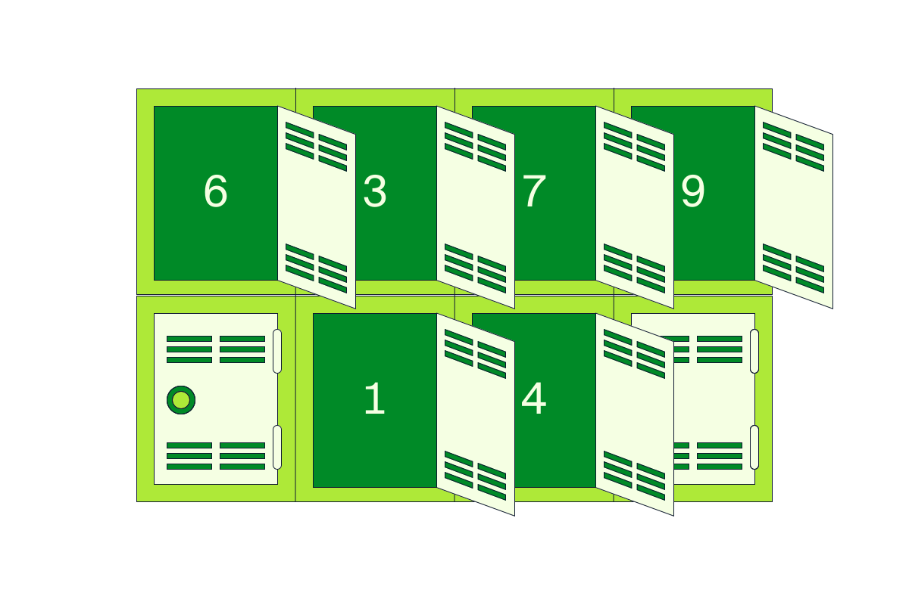
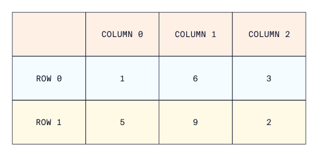
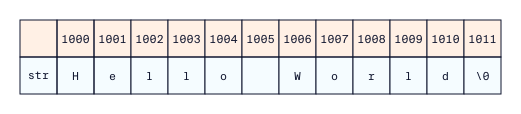

# Tableaux & Chaînes de caractères

Un tableau est un regroupement de variables du même type dans des blocs de mémoire contigus.

Cette structure de données est particulièrement utile dans les applications où il y a beaucoup de variables du même type qui sont liées les unes aux autres. Prenons l'exemple de la nécessité de stocker les trois coordonnées d'un point dans l'espace (coordonnées x, y et z). Une façon valide de stocker ces coordonnées dans des variables est la suivante :

```c
int main() {
  int xCoordonnées = 1;
  int yCoordonnées = 2;
  int zCoordonnées = 3;
}
```

Bien que cela soit correct, surtout pour un petit nombre de coordonnées, cela devient plus difficile à gérer lorsque le nombre de coordonnées augmente. Une solution à ce problème consiste à stocker les coordonnées dans une structure de données appelée **tableau**, comme suit :

```c
int main() {
  int coordonnees[3] = {1, 2, 3} ;
}
```

Ce morceau de code déclare une variable de type **tableau** appelée `coordonnees`.

Étant donné que les trois coordonnées sont liées les unes aux autres et qu'elles sont susceptibles d'être utilisées ensemble fréquemment, le tableau de coordonnées permet de les stocker dans une seule variable. 

Nous étudierons comment accéder aux éléments d'un tableau et les manipuler dans les prochains exercices. Sous le capot, la variable `coordonnees` crée trois variables entières en mémoire qui sont stockées de manière contiguë. Pour vous représenter visuellement, vous pouvez imaginer les tableaux comme un groupe de casiers, un peu comme ceux que l'on trouve dans une salle de sport, où chaque casier est responsable du stockage d'une variable de type int (ou de tout autre type que vous avez appris jusqu'à présent).




## Création et initialisation de tableaux

Un tableau est une collection de données qui peut être de n'importe quel type. Par exemple, vous pouvez construire un tableau d'entiers, de bools, de caractères, etc.

Il est possible de créer deux types de tableaux : 
- un tableau initialisé 
- un tableau non initialisé.

Comme son nom l'indique, un tableau non initialisé est créé sans spécifier les valeurs initiales qu'il contient. Par exemple, nous allons créer un tableau non initialisé appelé `age`, contenant quatre variables de type `int`, qui représentent l'âge de quatre frères et sœurs :

```c
int age[4];
```

Pour indiquer au compilateur que `age` est un tableau d'entiers et non une variable int unique, nous ajoutons `[taille_tableau]` (dans ce cas, taille_tableau est `4`) à la fin du nom de la variable.

Le modèle général pour créer un tableau non initialisé est :

```c
type nom[taille_tableau];
```

Lorsque vous créez un tableau non initialisé, vous devez spécifier sa taille afin que le compilateur puisse réserver la quantité appropriée de blocs de mémoire. Une fois qu'il est créé, la taille du tableau ne peut plus être modifiée, ce qui signifie que **les tableaux sont statiques**. Un tableau non initialisé peut être rempli plus tard dans un programme.

En revanche, un tableau initialisé est créé en spécifiant la valeur initiale de ses éléments. Par exemple, nous allons créer un tableau d'âges avec quatre âges initiaux :

```c
int age[] = {7, 27, 34, 63} ;
```

Le modèle général pour créer un tableau initialisé est le suivant :

```c
type nom_tableau[] = {valeur_1, valeur_2, valeur_3, …};
```

Notez que dans ce cas, vous n'avez pas besoin de spécifier la taille du tableau car elle est implicite à partir du nombre d'éléments fournis ; cependant, la déclaration d'un tableau initialisé avec la taille spécifiée fonctionnera également. L'exemple précédent aurait également pu être écrit comme ceci :

```c
int age[4] = {7, 27, 34, 63} ;
```

### À vous de jouer ! 🤠

1. Créez un nouvel espace de travail vide.

2. Créez un tableau non initialisé de cinq **doubles** appelé `q`.

3. Créez un tableau initialisé d'entiers appelé `pairs` composé des cinq premiers nombres pairs, **en commençant par 2**.

## Accès aux tableaux et modification des éléments

Les éléments d'un tableau peuvent être accédés, modifiés et utilisés comme toute autre variable du même type de données. L'exemple suivant montre comment accéder à un élément d'un tableau à l'indice `indice_x` :
```c
tableau[indice_x]
```

Le **premier élément** d'un tableau a l'**indice 0** et le **dernier élément** d'un tableau a l'indice **taille_tableau - 1**. Le **nième élément** est à l'indice **n-1**, donc, par exemple, le troisième élément serait à l'indice 2.

Un élément d'un tableau est modifié comme une variable ordinaire :


```c
tableau[indice_x] = nouvelle_valeur;
```


N'oubliez pas d'être cohérent avec les types de données ! 

Par exemple, les éléments d'un tableau d'entiers ne peuvent être modifiés que pour représenter d'autres valeurs entières ; toute autre modification entraînera des erreurs.

Lorsque vous travaillez avec des tableaux, il est important de faire attention et de ne pas essayer d'accéder à un élément à un indice supérieur à **taille_tableau - 1**, car la mémoire située à cet endroit pourrait stocker d'autres données. 

L'accès à un tableau à un indice supérieur à **taille_tableau - 1** renverra une valeur aléatoire. La modification d'un élément à un indice supérieur à **taille_tableau - 1** corrompt les données stockées à cet endroit, ce qui entraîne un comportement imprévisible du programme. 

Il en va de même pour l'accès au tableau à des indices inférieurs à zéro.

Le morceau de code suivant modifie un élément d'un tableau et l'affecte à une variable isolée :

```c
#include<stdio.h>
 
int main() {
    int tableau[] = {3, 5, 7, 9}; // Création et initialisation
    tableau[2] = 6 ; // Modifie le troisième élément
    int x = tableau[2] ; // Assigne le troisième élément à la variable solitaire x
    printf("%i", x) ; // Afficher x
}
```

### À vous de jouer ! 🤠

1. Après avoir repris un espace de travail vide, copiez-collez le code ci-dessous qui tente par erreur d'afficher la dernière valeur du tableau `pairs`. Corrigez ce bogue.

```c
#include<stdio.h>

int main() {

  int pairs[] = {2, 4, 6, 8, 10, 12} ;
  int impairs[] = {1, 4, 5, 7, 10, 11} ; // Ne pas modifier cette ligne.
  
  printf("%i\n", pairs[6]) ; // Question 1. Corrigez cette erreur.

  // Le code pour la question 2 va ici.

  // Le code pour la question 3 va ici.
  
}
```


2. Affichez le troisième élément du tableau `pairs`.


3. Le tableau `impairs` donné est censé contenir les six premiers nombres impairs. Remarquez que certaines valeurs sont incorrectes. Corrigez-les en remplaçant leur valeur par le nombre impair correct. Pour ce faire, **utilisez l'accès au tableau**.

## Déplacement dans les tableaux

Le principal avantage des tableaux est la possibilité de travailler avec de grandes quantités de données sans avoir à attribuer à chaque élément de données son propre nom de variable ; les tableaux contiennent donc généralement de nombreux éléments. 

Pour travailler avec ces éléments, vous devrez probablement faire quelque chose à plusieurs reprises. Comme vous l'avez appris plus tôt dans ce cours, **une boucle est utilisée pour exécuter un code répété**. La technique consistant à utiliser une boucle sur un tableau est appelée "bouclage du tableau". Rappelez-vous les deux types de boucles : la **boucle for** et la **boucle while**.

Voyons d'abord comment boucler un tableau à l'aide d'une boucle `while`. Prenons l'exemple d'un tableau composé de 20 entiers aléatoires dont vous souhaitez afficher le contenu à l'écran. 

Voici comment procéder à l'aide d'une boucle `while` :

```c
#include<stdio.h>
 
int main() {
  int tableau[] = {6, 9, 18, 37, 4, 23, 27, 16, 1, 30, 22, 7, 10, 25, 3, 2, 35, 11, 19, 28} ; // Tableau
  int i = 0 ; // Initialise l'indice i à zéro
  while(i < 20){ // Boucle while
    printf("%i\n", tableau[i]) ; // Accède à l'élément à l'index i dans tableau et affiche 
    i++ ; // Augmente l'indice de 1
  }
}
```

Dans ce morceau de code, nous avons  `tableau` composé de 20 entiers. Une variable indice `i` est déclarée et initialisée en dehors de la boucle.

La boucle s'exécute pour les indices inférieurs à la taille du tableau (dans ce cas, c'est 20). L'élément à l'indice i est affiché avec une nouvelle ligne. 

Enfin, l'indice est incrémenté de un.

Ce même processus peut être effectué en utilisant une boucle for comme suit :

```c
#include<stdio.h>
 
int main() {
  int tableau[] = {6, 9, 18, 37, 4, 23, 27, 16, 1, 30, 22, 7, 10, 25, 3, 2, 35, 11, 19, 28} ; // Création et initialisation
  for(int i = 0 ; i < 20 ; i++){ // boucle de recherche
    printf("%i\n", tableau[i]) ; // Accède à l'élément à l'indice i dans tableau et affichage
  }
}
```

### À vous de jouer ! 🤠

1. Après avoir repris un espace de travail vide, copiez-collez le code ci-dessous:
    ```c
    #include<stdio.h>

    int main() {
      int tableau[] = {3, 4, 5, 6, 7, 8, 9, 10, 11, 12, 13, 14, 15, 16, 17, 20, 22, 26, 28, 29};
      int tableau2[100];

      // Question 1

      // Question 2
    }
    ```

2. Bouclez dans le tableau `tableau` et affichez chaque élément sur une ligne séparée. Le tableau contient 20 éléments.


3. Étant donné le tableau d'entiers `tableau2`, remplissez le tableau de sorte que chaque élément du tableau soit égal à quatre plus l'indice de l'élément.

    Exemple :

    ```c
    tableau2[0] = 4, tableau2[1] = 5, tableau2[2] = 6, ...
    ```

## Longueur du tableau avec sizeof()

Jusqu'à présent, lors d'un déplacement dans un tableau, la taille du tableau était codée en dur dans la condition de la boucle. 

C'est une mauvaise pratique car la boucle ne s'applique qu'aux tableaux d'une seule taille.

Pour qu'une boucle soit valable pour des tableaux de n'importe quelle taille, on utilise la fonction `sizeof()`. `sizeof()` est une fonction spéciale qui renvoie un nombre entier correspondant à la **taille du tableau en octets**. 

La syntaxe de cette fonction est la suivante :

```c
sizeof(tableau) ;
```

Voici un exemple :
```c
int main() {
  int tableau[] = {3, 8, 4, 0, 9} ; 
  int longueur = sizeof(tableau) ; // Attribue la taille du tableau à la variable longueur
  printf("%i", longueur) ;
}
```

Le tableau contient cinq éléments, mais ce code affichera le nombre 20 au lieu de cinq, car `sizeof()` **renvoie le nombre total d'octets occupés par le tableau**, quel que soit le type d'éléments.

Rappelons qu'une **variable occupe plusieurs octets en mémoire déterminés par son type**. 

Dans ce cas, le tableau comporte cinq entiers, chacun d'entre eux occupant quatre octets de mémoire ; la taille totale est donc de **5 x 4 = 20 octets**. 

Pour obtenir le nombre réel d'éléments dans le tableau, nous devons **diviser la taille totale du tableau par la taille du type de données qu'il contient**. Heureusement, la fonction `sizeof()` peut également être appliquée à n'importe quel type de données pour déterminer sa taille en mémoire. La syntaxe est la même que celle d'un tableau :

```c
sizeof(type) ;
```

Nous pouvons modifier la variable `longueur` pour représenter le nombre d'éléments de `tableau`  comme suit :

```c
// Attribue la taille du tableau à la variable longueur. En se basant sur la taille d'un int.
int longueur = sizeof(tableau)/sizeof(int) ;
```

Le code affiche maintenant la taille attendue du tableau (cinq).

En utilisant cette technique, une boucle peut maintenant être écrite pour travailler avec des tableaux de longueur arbitraire. Voici un exemple :

```c
#include<stdio.h>
 
int main() {
  int tableau[] = {3, 2, 10, 6, 18, 5, 8, 4, 0, 9} ; 
  int longueur = sizeof(tableau)/sizeof(int) ;
  for(int i = 0 ; i < longueur ; i++){
    printf("%i\n", tableau[i]) ;
  }
}
```


Remarquez que dans la condition de la boucle for, la variable `longueur` est utilisée pour représenter la longueur du tableau, au lieu de la coder en dur. Nous pouvons encore simplifier le code ci-dessus en éliminant la variable `longueur` et en calculant directement la taille du tableau dans la condition de la boucle for.

```c
#include<stdio.h>
 
int main() {
  int tableau[] = {3, 2, 10, 6, 18, 5, 8, 4, 0, 9} ;
  for(int i = 0 ; i < sizeof(tableau)/sizeof(int) ; i++){
    printf("%i\n", tableau[i]) ;
  }
}

```

### À vous de jouer ! 🤠

1. Après avoir repris un espace de travail vide, copiez-collez le code ci-dessous:
    ```c
    #include<stdio.h>

    int main() {
      double tableau[] = {1.0, 8, 2.27, 16.2, 2, 3.14, 12.6, 1.62, 6.54, 9, 11} ;
      int longueur ;

      // La question 1 va ici.

      printf("%i\n", longueur) ;

      // La question 2 va ici.
    }
    ```
    
2. Définissez la variable `longueur` à la longueur du tableau .


3. Se déplacer dans le tableau et afficher son contenu. Chaque élément doit se trouver sur une nouvelle ligne.

## Tableaux multidimensionnels

Comme nous l'avons dit précédemment, les tableaux peuvent contenir n'importe quel type de données, qu'il s'agisse d'int, de char ou de tout autre type.

Il est intéressant de noter que les tableaux peuvent également stocker d'autres tableaux ! Un **tableau contenant d'autres tableaux** est connu sous le nom de **tableau multidimensionnel**. Ces types de tableaux sont fréquemment utilisés dans les applications mathématiques qui impliquent des matrices et des vecteurs.

Comme son homologue à une dimension, un tableau multidimensionnel peut être initialisé ou désinitialisé lors de sa création.

Examinons d'abord la version non initialisée. Le tableau suivant est un tableau bidimensionnel d'entiers appelé `mat` qui représente une matrice de trois sur quatre :

```c
int mat[3][4] ;

```

Le code précédent indique que le tableau `mat` contient trois éléments, chacun d'entre eux étant un tableau contenant quatre entiers.

Pour visualiser cela, considérez une rangée de trois casiers, dans laquelle chaque casier contient quatre sous-espaces dans lesquels quelqu'un peut stocker des objets. 

Pour illustrer comment créer un tableau multidimensionnel initialisé, nous allons créer un tableau multidimensionnel de deux par trois appelé `mat2` composé de valeurs entières aléatoires.

```c
int mat2[][3] = {{1, 6, 3}, {5, 9, 2}} ;
```


Tout comme dans le cas d'une dimension unique, le tableau est initialisé en plaçant les éléments entre les crochets `{}`.

Dans ce cas, les éléments à l'intérieur des crochets les plus extérieurs sont des tableaux de trois éléments chacun. 

Il est important de noter que si la dimension deux par trois peut être déduite du côté droit de l'expression, la seule dimension qui peut être omise est la première (remarquez que le premier `[]` est vide) ; toutes les autres doivent être fournies. Le tableau `mat2`, représente ce tableau :




Bien qu'il soit possible d'avoir un nombre théoriquement infini de dimensions, dans la pratique, les dimensions supérieures à deux sont très rares. 

Pour une matrice à deux dimensions, la **première dimension** représente le **nombre de lignes** et la **seconde**, le **nombre de colonnes**.


### À vous de jouer ! 🤠

1. Après avoir repris un espace de travail vide, copiez-collez le code ci-dessous:
    ```c
    #include<stdio.h>

    int main() {
        // Question 1
        
        // Question 2
    }
    ```
    
2. Créer un tableau bidimensionnel 9 x 9 non initialisé d'entiers appelé `mat`.

3. Étant donné le tableau suivant :


Créez un tableau bidimensionnel initialisé appelé `mat2` qui le représente.


## Accès aux éléments dans les tableaux multidimensionnels

L'accès aux éléments d'un tableau multidimensionnel se fait de la manière suivante :

```c
tableau[indice_ligne - 1][indice_colonne - 1] ;
```

Comme pour leurs homologues unidimensionnels, la première ligne est à l'indice 0, la nième ligne à l'indice n-1 et la dernière ligne à l'indice `taille_dim_1 - 1`. Il en va de même pour les colonnes.

Prenons l'exemple d'une matrice d'entiers de trois par trois :

```c
int mat[][3] = {{19, 6, 7}, {20, 3, 17}, {16, 13, 10}};
```

Pour accéder à l'élément de la deuxième ligne et de la troisième colonne, nous écrivons `mat[1][2]` (dans ce cas, il s'agit de `17`).

Le déplacement dans un tableau multidimensionnel est similaire au déplacement d'un tableau à une seule dimension, à la différence près qu'un tableau à plusieurs dimensions nécessite des boucles imbriquées.

Bien que vous puissiez utiliser des boucles `while` imbriquées, il est préférable d'utiliser une boucle `for` imbriquée. 

Dans le cas d'un tableau à deux dimensions, la boucle externe parcourt les lignes et la boucle interne parcourt les colonnes :

```c
int mat[3][3] = {{12, 8, 2}, {17, 19, 5}, {6, 11, 2}};
 
for(int i = 0; i < 3; i++){
  for(int j = 0; j < 3; j++){
    int num = mat[i][j];
    printf("%i\n", num);
  }
}
```

Pour éviter le codage en dur des dimensions dans une boucle, la fonction `sizeof()` est utilisée comme suit :

- `dimension_ligne = sizeof(matrice)/sizeof(matrice[0]) ;`
- `dimension_colonne = sizeof(matrice[0])/sizeof(type) ;`


Utilisons ces identités pour écrire la boucle `for` de l'exercice précédent :

```c
int mat[3][3] = {{12, 8, 2}, {17, 19, 5}, {6, 11, 2}};
 
int dimension_ligne = sizeof(mat)/sizeof(mat[0]);
int dimension_colonne = sizeof(mat[0])/sizeof(int);
 
for(int i = 0; i < dimension_ligne; i++){
  for(int j = 0; j < dimension_colonne; j++){
    int num = mat[i][j];
    printf("%i\n", num);
  }
}
```

### À vous de jouer ! 🤠

1. Après avoir repris un espace de travail vide, copiez-collez le code ci-dessous:
    ```c
    #include<stdio.h>

    int main() {
      int matrice[][4] = {{14, 10, 6, 4}, {3, 7, 18, 11}, {13, 9, 5, 17}, {19, 12, 2, 1}} ; 
      int somme = 0 ;

      // Question 1 va ici.

      // Question 2 va ici.
    }
    ```
    
2. Écrivez le code qui affiche l'élément qui se trouve sur la quatrième ligne et la deuxième colonne de la matrice.


3. Faites une boucle dans la matrice et additionnez tous les éléments. Attribuez votre réponse à la variable somme.

## Introduction aux chaînes de caractères

Votre tout premier exercice dans ce cours était la tâche traditionnelle consistant à imprimer la ligne `"Hello World"` à l'écran. 

Dans cette leçon, nous allons plonger plus profondément dans le type de données "Hello World" et explorer ses propriétés et fonctions. 

En C, la ligne `"Hello World"` est appelée **chaîne de caractères** car il s'agit simplement d'une chaîne de caractères. 

Les chaînes de caractères sont très importantes en programmation et en ingénierie logicielle car elles permettent au programme d'afficher les résultats à l'utilisateur et peuvent même être utilisées pour déboguer les erreurs.

Dans le langage de programmation C, **une chaîne est représentée par un tableau de caractères** et est donc soumise à toutes les propriétés et méthodes associées aux tableaux. 

La fonction la plus courante utilisée avec les chaînes de caractères est la fonction `printf()`, comme vous l'avez vu précédemment.





## Création et initialisation de chaînes de caractères

La création d'une chaîne de caractères peut s'effectuer de deux manières. La première consiste à créer simplement un tableau de caractères initialisé rempli par les caractères de la chaîne. Voici un exemple de la chaîne "Hello World" créée à l'aide d'un tableau initialisé :

```c
char chaine[] = {'H', 'e', 'l', 'l', 'o', ' ', 'W', 'o', 'r', 'l', 'd', '\0'} ;
```


Le tableau de caractères est rempli par les caractères de `"Hello World"`.

Il y a deux choses importantes à noter ici :

- Un espace vide est un caractère, il est donc inclus en mettant un espace entre guillemets simples.
- Le tout dernier caractère du tableau est `'\0'`, connu sous le nom de caractère de fin de chaîne. Il signifie la fin de la chaîne et doit être inclus lors de la création d'une chaîne en tant que tableau initialisé.

La chaîne "Hello World" comporte 11 caractères (l'espace est aussi un caractère !) mais la taille de `chaine[]` est de `12` : 11 caractères pour "Hello World" plus un pour le caractère `'\0'`.

La deuxième façon de créer une variable de type chaîne en C est d'utiliser ce que l'on appelle un littéral de chaîne. Il s'agit de la création d'une chaîne de caractères en initialisant le tableau de chars avec la chaîne de caractères complète entre guillemets, comme suit :

```c
char chaine[] = "Hello World" ;
```

Il s'agit toujours d'un tableau de caractères et il doit être traité comme tel. Le seul avantage de créer une chaîne de caractères de cette manière est qu'elle est plus facile à taper et que le caractère de fin de chaîne nul `'\0'` est ajouté implicitement. 

La taille de ce tableau est toujours de 12 pour les mêmes raisons que celles mentionnées précédemment.

L'utilisation de la fonction `printf()` pour afficher la chaîne se fait en fournissant le nom de la chaîne `chaine`, indépendamment de la façon dont elle a été créée, et `%s` pour signifier que `printf()` travaille avec une chaîne. 

Voici un exemple :
```c
char chaine[] = "Hello World" ;
printf("%s", chaine) ; // Cela n'affichera pas une nouvelle ligne
printf("%s\n", chaine) ; // Une nouvelle ligne sera affichée.
```

Remarque : les caractères en C sont sensibles à la casse ; par exemple, les caractères `'A'` et `'a'` sont traités comme deux types de caractères différents.

## À vous de jouer ! 🤠

1. Après avoir repris un espace de travail vide, copiez-collez le code ci-dessous:
    ```c
    #include<stdio.h>

    int main() {
      // Question 1

      // Question 2

      // Question 3     
    }
    ```
    
2. Créez la chaîne `"Ordinateur"` en utilisant un tableau de caractères initialisé. La variable doit être appelée `ch1`.


3. En utilisant une chaîne littérale, créez une chaîne appelée `ch2` contenant la chaîne `"Code informatique"`.


4. Affichez la chaîne stockée dans `ch1` suivie de la chaîne stockée dans `ch2` sur des lignes séparées.


## Accès et modification des caractères

Les caractères d'une chaîne de caractères sont accessibles à l'aide des mêmes méthodes que celles utilisées pour un tableau ordinaire.

Il est important de noter que, puisque les **chaînes sont des tableaux de caractères**, elles sont **soumises aux mêmes contraintes qu'un tableau**. 

Cela signifie qu'une chaîne ne peut pas être étendue pour ajouter de nouveaux caractères, et qu'un caractère d'une chaîne ne peut pas être supprimé !

Rappelez-vous que dans la leçon sur les tableaux, l'accès à un élément d'un tableau se fait de la manière suivante :

```c
tableau[indice] 
```

Dans le cas des chaînes de caractères, l'`indice`, représente le caractère à cet indice. Et comme pour les tableaux, le nième caractère est à l'indice n-1. Voici un exemple :

```c
char ch1[] = {'H', 'e', 'l', 'l', 'o', ' ', 'W', 'o', 'r', 'l', 'd', '\0'} ;
char ch2[] = "Hello World" ;
 
printf("%c\n", ch1[6]) ; // "%c" nécessaire pour indiquer à printf() qu'il doit attendre un caractère.
printf("%c", ch2[6]) ;
```

Le code ci-dessus crée la chaîne `"Hello World"` dans les deux sens. ch1[6] et ch2[6] accéderont au caractère à l'indice 6, qui est le septième caractère des deux chaînes, respectivement. Dans ce cas, ce caractère est `'W'`, qui est le même pour les deux chaînes puisqu'elles sont identiques.

La modification d'un caractère dans une chaîne s'effectue de la même manière que la modification d'un élément dans un tableau, quelle que soit la manière dont la chaîne a été créée :

```c
tableau[indice] = nouvelle_valeur;
```

Dans le cas des chaînes de caractères, `nouvelle_valeur` représente le nouveau caractère à placer.

Rappelez-vous qu'il n'est pas possible d'ajouter des caractères ou de les supprimer. Voici un exemple :

```c
char ch1[] = "Hello Yorld" ;
printf("%s\n", ch1) ; // Ceci va afficher Hello Yorld à l'écran.
 
ch1[6] = 'W' ; // Remplacez 'Y' par 'W'.
printf("%s\n", ch1) ; // Cette commande affiche Hello World à l'écran.

```

### À vous de jouer ! 🤠

1. Après avoir repris un espace de travail vide, copiez-collez le code ci-dessous:
    ```c
    #include <stdio.h>

    int main() {
      char p[] = "proceszeur" ;
      // Question 1
        
      // Question 2
        
      printf("%s", p) ;
    }
    ```

2. Affichez le troisième caractère de la chaîne `p`.


3. La chaîne de caractères `p` affiche de manière fausse le mot "processeur". Corrigez cette erreur et affichez la chaîne sur la console.


## Se déplacer sur des chaînes de caractères

Tout comme avec les tableaux, nous pouvons également parcourir une chaîne de caractères en boucle pour accéder à ses caractères ou les modifier ! 

Vous pouvez utiliser une boucle `while` ou une boucle `for`, mais dans la plupart des cas, la boucle `for` est beaucoup plus pratique. Voici un exemple de boucle dans une chaîne de caractères :

```c
char ch[] = "Hello World";
 
for(int i = 0; i < 11; i++) { 
  printf("%c", ch[i]);
}
```

Ce code va parcourir en boucle la chaîne de caractères "Hello World" et afficher les caractères à l'écran. Notez que dans une boucle, il n'est pas nécessaire de tenir compte du caractère de fin de chaîne nul, car il est peu probable que vous ayez à l'utiliser.

Cependant, il y a un petit problème avec ce code. La boucle `for` code en dur la longueur de la chaîne (11 dans ce cas) dans l'instruction de condition.

Écrire des boucles de cette manière pose un problème car la longueur de la chaîne est rarement connue à l'avance et fait que cette boucle n'est valable que pour les chaînes de 11 caractères !

Pour remédier à ce problème et rendre la boucle valable pour des chaînes de n'importe quelle longueur, nous pouvons utiliser la fonction `strlen()`. Cette fonction détermine la longueur de la chaîne de caractères.

Elle s'utilise comme suit :

```c
strlen(ch)
```

La fonction `strlen()` est une fonction spéciale de chaîne de caractères contenue dans la bibliothèque `string`. Pour l'utiliser, le code doit inclure la ligne suivante en haut du fichier :

```c
#include <string.h>.
```

L'exemple de code ci-dessus peut maintenant être écrit comme suit :

```c
#include<stdio.h>
#include<string.h>
 
int main() {
  char ch[] = "Hello World" ;
 
  for(int i = 0 ; i < strlen(ch) ; i++) { // Utilisation de strlen au lieu de coder la longueur de la chaîne en dur
    printf("%c", ch[i]) ;
  }
}
```

Notez que `strlen()` ne tient pas compte du caractère de fin de chaîne.

## À vous de jouer ! 🤠

1. Après avoir repris un espace de travail vide, copiez-collez le code ci-dessous:

```c
#include<stdio.h>
#include<string.h>

int main() {
  char s[] = "les sanglots longs des violons de l'automne" ;
  char p[] = "poolloop" ;  
  // Question 1
  printf("%s\n", s) ;
  // Question 2
  printf("%s", p) ;
}
```

2. La chaîne de caractères `s` contient un message qui doit être dissimulé. En utilisant une boucle, remplacez chaque caractère de la chaîne par le caractère `'*'`.


3. La chaîne p contient la chaîne "pool" et sa chaîne miroir "loop". Faites une boucle dans la chaîne et remplacez la première moitié par des `'#'`.


## Concaténation de chaînes de caractères

Tout comme il existe une fonction pour les chaînes de caractères qui renvoie leur longueur (`strlen()`), la bibliothèque des chaînes de caractères contient d'autres fonctions utiles pour les chaînes de caractères. 

> Concaténer signifie **lier ou joindre ensemble plusieurs choses** (généralement des chaînes de caractères, des tableaux, etc.). Cela implique de prendre des éléments distincts et de les fusionner en un seul objet en conservant l'ordre des éléments originaux.

Dans cet exercice, nous allons explorer comment **concaténer deux chaînes de caractères** en utilisant la fonction `strcat()`.

La fonction `strcat()` prend une chaîne, `src`, et l'ajoute à la fin d'une autre chaîne, `dst`. L'utilisation de cette fonction ne crée pas une troisième chaîne distincte, mais modifie la chaîne `dst` pour inclure la chaîne `src` à la fin. La syntaxe de cette fonction est la suivante

```c
strcat(dst, src) ;
```


À première vue, il peut sembler qu'une certaine magie a eu lieu ici, car on sait que les chaînes de caractères (parce qu'elles sont des tableaux) sont immuables !

En fait, la fonction prend les deux chaînes de caractères et crée un tableau de caractères de taille `strlen(src) + strlen(dst) + 1`. Elle remplit ensuite le tableau avec les caractères des deux chaînes de caractères en commençant par `dst`. 

Enfin, il supprime la mémoire occupée par la chaîne `dst` originale et associe la variable de la chaîne `dst` au nouveau tableau de caractères créé.

Tout ceci est fait pour vous "sous le capot" en utilisant le concept des pointeurs, un sujet qui sera abordé dans une prochaine leçon.

Voici l'exemple en action :

```c
#include<stdio.h>
#include<string.h> // N'oubliez pas d'inclure ceci !
 
int main() {
  char s1[] = "abcd" ;
  char s2[] = "efgh" ;
  strcat(s1, s2) ;
  printf("%s", s1) ; 
  // La sortie sera "abcdefgh".
}
```

### À vous de jouer ! 🤠

1. Après avoir repris un espace de travail vide, copiez-collez le code ci-dessous:
```c
#include<stdio.h>
#include<string.h>

int main() {
    
  char s1[] = "Londres" ;
  char s2[] = "Pont" ;

  char n[] = "New" ;
  char y[] = "York" ;
  char c[] = " City " ;

  // Question 1
  
  // Question 2

}
```

2. Concaténer les chaînes `s1` et `s2` et afficher le résultat, inclure un saut de ligne à la fin de la chaîne.


3. Concaténer les chaînes de caractères `n`, `y`, `c` et afficher le résultat.

## Copie de chaînes de caractères

Dans cet exercice, nous allons examiner la fonction `strcpy()` qui est utilisée pour copier une chaîne de caractères dans un tableau de caractères vide (chaîne vide). La syntaxe de cette fonction est la suivante

```c
strcpy(dst, src) ;
```

Étant donné une chaîne `src` et une chaîne vide (tableau de caractères vide) `dst`, la fonction `strcpy()` copie le contenu de la chaîne `src` dans la chaîne `dst`. 

Il est important que la taille du tableau de caractères vide, `dst`, soit supérieure ou égale à la longueur de la chaîne `src`, plus un pour le caractère de fin de chaîne (`'\0'`), afin d'accueillir tous les caractères entrants.

Si le tableau de caractères dst est trop court, le programme présentera un comportement non défini. Comme pour la fonction `strcat()`, une nouvelle chaîne ne sera pas créée.

L'exemple suivant illustre l'utilisation de `strcpy()` :

```c
#include<stdio.h>
#include<string.h>
 
int main() {    
  char s1[] = "ABCD" ;
  char s2[5] ; // Chaîne vide de cinq caractères
  strcpy(s2, s1) ;    
  printf("%s", s2) ; // Affiche : ABCD
}
```

### À vous de jouer ! 🤠

1. Après avoir repris un espace de travail vide, copiez-collez le code ci-dessous:

```c
#include<stdio.h>
#include<string.h>

int main() {
  
  char src[] = "banane" ;
  char dst[7] ;
  
  char ch[] = "Liberté, égalité, fraternité.";
  int longueur = 0 ; // Question 2
  char dst2[len] ;
  
  // Question 1
  
  printf("%s\n", dst) ;  
  
  // Question 3
  
  printf("%s", dst2) ;

}
```


2. Copiez la chaîne de caractères de `src` à `dst`.


3. La variable `longueur` représente la taille d'un tableau vide de caractères qui sera utilisé pour recevoir la chaîne copiée. Initialement, elle contient le nombre zéro.

    Modifiez la variable `longueur` pour que le tableau vide, `dst2`, ait suffisamment d'espace pour stocker les lettres de la chaîne `ch`.


4. Copiez les lettres de `ch` dans `dst2`.
