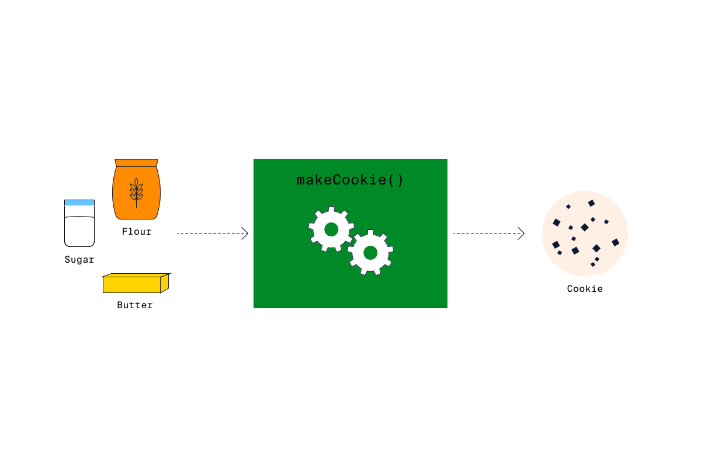

# Introduction aux fonctions 

Au fur et à mesure que vous écrivez du code, vous aurez parfois besoin de réutiliser un ensemble d'instructions. Vous pourriez être tenté de réutiliser le code en le copiant et en le collant, mais dans de tels cas, une fonction est un outil très utile.

Une fonction est un groupe d'instructions auquel on attribue un nom qui sera utilisé ailleurs dans le code, souvent de manière répétée. Les fonctions peuvent recevoir un ensemble d'entrées et produire une sortie.




Dans la photo ci-dessus, nous utilisons l'idée d'une fonction permettant de fabriquer des biscuits.

Nous rassemblons un ensemble d'instructions (la recette) sous le nom **makeCookie**. La fabrication d'un biscuit nécessite un ensemble d'intrants (les ingrédients). Les instructions contenues dans la fonction agissent sur les ingrédients en entrée pour produire la sortie (un biscuit !).

Les fonctions sont idéales pour les raisons suivantes :

- Vous pouvez écrire du code sans vous répéter DRY (Don't Repeat Yourself).
- Vous pouvez exécuter n'importe quel nombre d'instructions avec une seule ligne de code.
- Une fois qu'une fonction existe, vous ne devez vous préoccuper que des entrées et des sorties, et non des instructions qu'elle contient.

En C, vous avez déjà travaillé avec une fonction. La fonction `main()` est le point d'entrée de tout programme C et vous la comprendrez mieux au fil de cette leçon.


### À vous de jouer !  🤠

Regardez la fonction `main()` dans le code ci-dessous. Il y a 2 lignes, une qui appelle une fonction `abs()` et ensuite la fonction `printf()` pour afficher la valeur dans `valAbsolue`.

1. Exécutez le programme pour voir la sortie et réfléchissez à tout ce qui se passe dans le code et que nous ne pouvons pas voir. Il s'agit d'un bon exemple de codage DRY (Don't Repeat Yourself) (sans répétition) dans le langage de programmation C.


```c
#include <stdio.h>
#include <stdlib.h>

int main(void) {
  int valAbsolue = abs(-5);
  printf("%d\n", valAbsolue);
}
```


## Appel d'une fonction

Comme nous l'avons vu, le code `printf("Hello, World\n")` affiche la chaîne de caractères entre les parenthèses sur la console. L'utilisation générale d'une fonction consiste à "appeler" le nom donné avec un ensemble de parenthèses. Toute entrée nécessaire à la fonction est placée à l'intérieur des parenthèses.

Ces entrées sont communément appelées les **arguments de la fonction**.

Certaines fonctions ne prennent aucun argument, d'autres en prennent un et d'autres encore en prennent plusieurs. Quoi qu'il en soit, il est important de connaître les arguments attendus par une fonction afin d'utiliser les bonnes valeurs aux bons endroits.

La fonction `printf()` peut modifier son comportement en fonction du nombre d'arguments qu'elle reçoit.

```c
#include <stdio.h>
 
printf("Hello, World!"); // Affiche: Hello, World!
int num = 9;
printf("Mon nombre est %d", num); // Affiche: Mon nombre est 9
```

Dans l'exemple ci-dessus, le premier appel à `printf()` prend la chaîne `"Hello, World !"` comme argument.

1. La sortie est la chaîne de caractères.
2. Le deuxième appel à printf() prend deux arguments, une chaîne et une variable. La sortie est cette fois la chaîne de caractères avec la variable insérée à l'endroit indiqué par `%d`.

Ces deux utilisations de `printf()` montrent la flexibilité permise par l'utilisation des fonctions.

Enfin, une fonction peut renvoyer sa sortie, qui peut ensuite être utilisée. En voici un exemple :

```c
#include <stdio.h>
#include <stdlib.h>
 
int valAbsolue = abs(-5) ;
printf("Valeur absolue de -5 : %d\n", valAbsolue) ;
 
// Affiche
// Valeur absolue de -5 : 5
```

Dans l'exemple ci-dessus, nous utilisons une fonction différente, `abs()`, qui renvoie la valeur absolue d'un entier passé en argument. Nous pouvons utiliser cette fonction en ajoutant la ligne `#include <stdlib.h>` au début du code.

Comme nous pouvons le voir, lorsque nous appelons `abs(-5)`, nous l'assignons à l'entier `valAbsolue`. Ceci affecte la valeur retournée par abs(-5) à la variable `valAbsolue`. Ceci est démontré par la sortie de la valeur qui est 5.

### À vous de jouer !  🤠

1. Dans un espace de travail vierge, récupérer le code suivant:

```c
#include <stdio.h>

int main(void) {
  int num1 = -5;
  int num2 = 42;
  // Écrire le code ci-dessous
  
}
```

Examinons les différentes configurations des arguments de la fonction `printf()`.

2. Ajoutez un appel à `printf()` sans arguments.

    - Vous devriez obtenir une erreur lorsque vous appelez `printf()` sans arguments ?


3. Ajoutez maintenant une chaîne de votre choix aux arguments de `printf()`.

    - Le code fonctionne-t-il maintenant ?


4. Ajoutez maintenant la valeur de la variable `num1` dans `printf`.

    - Veillez à ajouter la variable en tant qu'argument et à ajuster votre chaîne de caractères pour prendre en charge la sortie de la variable.


5. Pouvons-nous ajouter une autre variable à la sortie ? Essayez !
    - Ajoutez la variable num2 comme troisième argument et ajustez la chaîne pour qu'elle affiche les valeurs des deux variables.
    
    

## Fonctions de  bibliothèques

Maintenant que nous savons comment appeler des fonctions, utiliser leurs arguments et capturer leurs valeurs de retour, examinons quelques fonctions fournies par le langage de programmation C.

Le langage C nous donne accès à de nombreuses bibliothèques utiles qui incluent de nombreuses fonctions différentes à utiliser. Pour avoir accès à ces fonctions, vous devez inclure des fichiers d'en-tête tels que `<stdio.h>` et `<stdlib.h>`.

Vous avez déjà utilisé `printf()` pour afficher du texte sur la console et appris à connaître `abs()` pour trouver la valeur absolue d'un entier. Voici quelques autres fonctions que vous pourriez utiliser dans vos programmes :

- `ceil()` : prend un nombre quelconque comme argument, l'arrondit à l'entier le plus proche et renvoie l'entier.
- `log()` : prend un entier en argument et renvoie le logarithme naturel du nombre donné.
- `toupper()` : prend un caractère comme argument et retourne la majuscule de n'importe quel caractère alphabétique.
- `isupper()` : prend un caractère comme argument et renvoie 1 si le caractère est une lettre majuscule, 0 sinon.

Utilisons ces fonctions dans un peu de code :


```c
#include <stdio.h>
#include <math.h>
#include <ctype.h>
 
int main() {
  float nombre = 4.5;
  char lettre = 'a';
  printf("%f\n", ceil(nombre)); // 5.000000
  printf("%f\n", log(nombre)); // 1.504077
  printf("%d\n", isupper(lettre)); // 0
  lettre = toupper(lettre);
  printf("%d\n", isupper(lettre)); // 1
}
```

Dans l'exemple ci-dessus :

- Les bibliothèques `math.h` et `ctype.h` sont utilisées dans ce code.
- La variable `nombre` est passée à `ceil()` et affichée. Le résultat est 5.000000.
- La variable `nombre` est passée à `log()` et affichée. Le résultat est 1.504077.
- La variable `lettre` est passée à `isupper()` et affichée. Le résultat est 0, ce qui représente `False`.
- La variable `lettre` est passée à `toupper()` et assignée à `lettre`.
- La nouvelle valeur de la variable `lettre` est passée à `isupper()` et affichée. Le résultat est 1, ce qui correspond à `True`.

Les bibliothèques standard du langage C contiennent de nombreuses fonctions utiles. Voici une liste de quelques-unes d'entre elles. Cela vaut la peine de les parcourir pour voir comment elles peuvent aider votre code.

### À vous de jouer ! 🤠

1. Dans un espace de travail vierge, récupérer le code suivant:

```cpp
#include <stdio.h>
#include <stdlib.h>
#include <time.h>

int main(void) {
  srand(time(NULL));
  // Écrire votre code ci-dessous
}
```


Examinons maintenant d'autres bibliothèques et leurs fonctions pour créer des nombres aléatoires.

il y a 3 déclarations #include :

- La première est nécessaire pour `printf()`.
- `#include <stdlib.h>` est nécessaire pour 2 fonctions du générateur de nombres aléatoires, `srand()` et `rand()`.
- `#include <time.h>`est nécessaire pour utiliser la fonction `time()`.

Dans la fonction `main()` se trouve la ligne `srand(time(NULL)) ;`.

Sans cette ligne de code, tous les nombres aléatoires générés dans cet exercice **seront les mêmes à chaque fois que vous exécuterez le code**.


2. Une fois le générateur de nombres aléatoires initialisé, il est temps d'obtenir un nombre aléatoire. Cela se fait en sauvegardant la valeur de retour de la fonction `rand()`.

- Dans la fonction main() :

    1. Déclarez une variable entière `nomAleatoire` et donnez-lui la valeur `rand()`.
    2. Affichez la valeur de randomNumber à l'aide de `printf()`

 Si vous exécutez le code plusieurs fois, vous devriez obtenir un nombre important mais légèrement différent à chaque fois.


Il y a de fortes chances pour que le nombre généré en ce moment ne soit pas utile dans sa forme actuelle si vous programmez un jeu qui veut lancer des dés. Pour obtenir le nombre que nous voulons, nous allons utiliser l'opérateur modulo (`%`).

Dans la fonction `main()` :

3. En utilisant `%`, modifiez la ligne de code, `int nomAleatoire = rand()` pour que nomAleatoire soit **compris entre 0 et 19**.
    - Ajoutez un `+ 1` à la fin du code pour que `nomAleatoire` devienne un nombre **compris entre 1 et 20**.
    - Chaque fois que vous exécutez le code, vous devriez obtenir un nombre compris entre 1 et 20.
    
 ## Définition des fonctions

Nous avons vu que le langage C est fourni avec de nombreuses bibliothèques de fonctions pratiques à utiliser. Apprenons maintenant à créer les nôtres ! Pour commencer, nous avons besoin d'une signature de fonction.

La signature d'une fonction nous indique 3 choses :

- le **nom** de la fonction
- le **nombre** de paramètres (entrées) et leur **type**
- le **type** de **valeur de retour** attendu

```c
Type de retour nomfonction (type1 paramètre1, type2 paramètre2)
```


Si une fonction ne renvoie aucune valeur, on utilise `void` comme type de retour. 

`void` indique au compilateur que la fonction ne renvoie aucune donnée et ne doit pas s'attendre à voir le mot-clé return. Tous les types abordés dans les leçons précédentes (int, char, boolean, etc.) peuvent être utilisés comme type de retour d'une fonction.

De même, si une fonction n'a pas de paramètres, le mot `void` doit être utilisé à la place des paramètres.

Les paramètres énumérés entre les parenthèses sont comme des déclarations de variables. Chaque paramètre doit commencer par le type, puis le nom du paramètre.

Les instructions de code "à l'intérieur" de la fonction sont appelées **le corps de la fonction** et sont placées entre accolades après la signature de la fonction.

```c
typeRetour nomFonction (type1 paramètre1, type2 paramètre2) {
  // code ;
  // code ;
  // code ;

return sortie;
}
```

La signature et le corps sont les deux parties dont nous avons besoin pour créer nos propres fonctions.
```c
void makeCookie(){
  printf("Lait") ;
  printf("Farine") ;
  printf("Pépites de chocolat") ;
  printf("Beurre") ;
  printf("Voici un cookie!\n") ;
}
```

Et pour appeler la fonction :

```c
makeCookie();
```

### À vous de jouer ! 🤠

1. Dans un espace de travail vierge, récupérer le code suivant:

```c
#include <stdio.h>

// Ecrivez votre code ci-dessous

int main(void) {

}
```

Il est temps de créer votre première fonction !


2. Au-dessus de la fonction `main()` :

    - Définissez une nouvelle fonction nommée afficherMonAnimalFavoris()
    - La fonction ne renvoie aucune valeur
    - La fonction n'a pas de paramètres
    - Laissez le corps `{ }` de la fonction vide pour l'instant


3. Dans le corps de la fonction :

    - Affichez le message "Mon animal préféré est VOTRE_NOM_ANIMAL".
    - La fonction est terminée, passez donc à l'appel de votre première fonction complète !


4. Enfin, à l'intérieur de la fonction `main()` :

    - Appelez la fonction `afficherMonAnimalFavoris()`


## Valeurs de retour des fonctions

Nous savons maintenant comment définir une fonction, alors regardons de plus près les valeurs de retour des fonctions. L'appel d'une fonction pour effectuer un travail et renvoyer une valeur est une utilisation courante des fonctions. Il est important de comprendre comment définir le type de valeur renvoyée et de s'assurer qu'elle est bien renvoyée.

La plupart des types C que nous avons vus jusqu'à présent peuvent être utilisés comme type de retour de fonction, comme `int`, `double`, `char`, et même les pointeurs.

```c
int obtenirNumeroSecret() {
  int numeroSecret = 7 ;
  return numeroSecret ;  
}
```

Dans l'exemple ci-dessus :

- La fonction a un type de retour `int`
- La variable `numeroSecret`, de type `int`, est fixée à 7.
- La variable est renvoyée à l'aide de la fonction return `numeroSecret`
- Le type de la valeur renvoyée à l'intérieur de la fonction doit correspondre au type défini dans la signature de la fonction. En cas de non-concordance, vous obtiendrez une erreur de compilation vous informant de la non-concordance.

Une fois l'instruction **return exécuté**, la **fonction redonne le contrôle à la fonction qui l'a appelée** et aucun autre code à l'intérieur de la fonction ne sera exécuté. Par exemple :

```c
int obtenirNumeroSecret() {
  int numeroSecret = 7 ;
  return numeroSecret ;  
  print("Ne le dis à personne ;)");
}
```

L'instruction `printf()` ne s'exécutera pas et "Ne le dis à personne ;)" ne s'affichera pas dans le terminal de sortie.

### À vous de jouer ! 🤠

1. Dans un espace de travail vierge, récupérer le code suivant:

```c
#include <stdio.h>
#include <stdlib.h>
#include <time.h>

// Modifier le code ci-dessous
void obtenirAleatoire1000() {
  int nombreAleatoire1000 = rand() % 1000 + 1;
  
}

int main(void) {
  srand(time(NULL));
  // Modifier le code ci-dessous
  int nombreAleatoire = 0;
  printf("Mon nombre aléatoire est: %d", nombreAleatoire);
}
```

2. En poursuivant la génération de nombres aléatoires, modifiez la définition d'une fonction afin qu'elle puisse renvoyer un nombre aléatoire compris entre 1 et 1000 :

    - La fonction obtenirAleatoire1000() a actuellement un type de retour void.

    - Modifiez le type de retour pour que la fonction puisse renvoyer un entier.


3. Maintenant, à la fin du corps de la fonction obtenirAleatoire1000() :
    - Renvoyer la variable `nombreAleatoire1000`


4. Enfin, dans la fonction `main()` :
    - Remplacez le 0 par un appel à `nombreAleatoire1000()` et stockez la valeur de retour dans la variable nombreAleatoire.


## Paramètres des fonctions

Dans le dernier exercice, nous avons créé une fonction `obtenirAleatoire1000` qui renvoie un nombre aléatoire compris entre 1 et 1000. 

Que se passerait-il si nous voulions que la borne supérieure soit 10000 ou 1000000 ? Nous pourrions définir de nouvelles fonctions telles que `obtenirAleatoire1000` ou `obtenirAleatoire1000000()`. Il doit y avoir une meilleure solution.

En plus de renvoyer des valeurs, les fonctions peuvent personnaliser leur comportement en fonction de l'argument qui leur est transmis. Pour ce faire, elles définissent des paramètres dans la signature de la fonction.

Les paramètres sont des définitions de variables qui prennent place entre les parenthèses de la signature de la fonction. Ils ont un type et un nom à utiliser à l'intérieur et uniquement à l'intérieur du corps de la fonction. 

Jetons un coup d'œil !

```c
int somme(int nombre1, int nombre2) {
  int somme = nombre1 + nombre2;
  return somme;
}
 
int main() {
  int nombresAjoutes = somme(3, 6);
  // nombresAjoutes = 9
}
```

Dans l'exemple ci-dessus :

- La fonction somme() est définie avec un type de retour entier
- La fonction prend deux paramètres entiers, `nombre1` et `nombre2`, à utiliser dans le corps de la fonction.
- La fonction additionne les nombres, les affecte à un entier, `somme`, et renvoie `somme`.

Il convient de garder à l'esprit que si le type de paramètre et l'argument transmis à une fonction ne correspondent pas, un avertissement ou une erreur se produira lors de l'exécution du code.

```c
#include <stdio.h>
 
void parle(int nombre) {
  printf("%d\n", nombre);
}
 
int main(void) {
  char* chaine = "Bonjour!";
  parle(chaine);
}
```

Le code ci-dessus produira un avertissement indiquant que le type d'argument de la fonction `parle`, `char*`, et le type de paramètre, `int`, ne sont pas les mêmes. Il en résultera un comportement indésirable.

La dernière chose à noter à propos des paramètres est que si une fonction n'a pas de paramètres, vous devez mettre void entre les parenthèses. Les laisser vides ne pose généralement pas de problème, mais il est préférable d'utiliser `void`.


### À vous de jouer ! 🤠

1. Dans un espace de travail vierge, récupérer le code suivant:

```c
#include <stdio.h>
#include <stdlib.h>
#include <time.h>

// Modifier le code ci-dessous
void obtenirAleatoire() {
  int nombreAleatoire = rand() % 1000 + 1;
  return nombreAleatoire;
}

int main(void) {
  srand(time(NULL));
  // Modifier le code ci-dessous
  int nombreAleatoire = 0;
  printf("Mon nombre aléatoire est: %d", nombreAleatoire);
}
```

2. La fonction `obtenirAleatoire1000()` a été remplacée par `obtenirAleatoire()`.
    - Modifiez le reste de la définition de la fonction en ajoutant un paramètre entier `nombreMax`.


3. Dans le corps de la fonction obtenirAleatoire(), utilisez le paramètre pour définir la plage :

    - Remplacer le nombre supérieur de la plage dans l'équation aléatoire par `nombreMax`


4. Testez maintenant la nouvelle fonction !

    - Dans la fonction main() :

    - Assignez `nombreAleatoire` à obtenirAleatoire() avec l'argument 100

Vous pouvez maintenant générer un nombre aléatoire compris entre 1 et le nombre de votre choix. Bon travail !


## Fonctions avec pointeurs

Nous avons fait de grands progrès jusqu'à présent avec les fonctions !

Jusqu'à présent, lorsqu'une fonction recevait un argument, elle faisait une copie de la valeur de l'argument et la stockait dans la variable paramètre. Désormais, tout travail effectué par la fonction sur cette variable paramètre n'affectera pas la valeur originale qui lui a été transmise.

Par exemple :

```c
#include <stdio.h>
 
void maFonction(int a){
  a = a + 2;
  printf("a dans maFonction() %d\n", a);
}
 
int main(){
  int a = 10;
  maFonction(a);
  printf("a dans main(): %d\n", a);
}
 
//Affichage:
// a inside maFonction(): 12;
// a dans main(): 10;
```

C'est une bonne chose car nous pouvons modifier en toute sécurité la valeur de la variable à l'intérieur de la fonction tout en conservant la valeur originale à l'extérieur.

Que faire si nous voulons modifier la variable à l'intérieur de la fonction ? Au lieu de passer la variable réelle comme argument, nous pouvons passer un pointeur vers la variable. Rappelons qu'un pointeur est une variable qui contient l'adresse mémoire d'une autre variable. L'adresse mémoire indique où se trouve la variable originale dans la mémoire.

Avant de passer un pointeur à une fonction, nous devons nous assurer que le type de paramètre correspond au type de pointeur que nous passons. Avec un pointeur comme paramètre, le corps de la fonction peut directement modifier la valeur originale du pointeur qui a été passé :

```c
void maFonction(int* a){
  *a = *a+2;
  printf("a dans maFonction(): %d\n", *a);
}
 
int main(){
  int a = 10;
  int* pt_a = &a;
  maFonction(pt_a);
  printf("a dans main(): %d\n", a);
}
 
//Affichage:
// a dans maFonction(): 12;
// a dans main(): 12;
```

L'utilisation d'un pointeur vers une variable plutôt que de la variable elle-même présente l'avantage d'économiser de la mémoire, car la fonction n'a pas besoin d'allouer davantage de mémoire pour des types de données complexes tels que les tableaux.


Utilisez la syntaxe suivante pour passer l'adresse d'une variable comme argument :

```c
nomFonction(&nomVariable) ;
```


### À vous de jouer ! 🤠

1. Dans un espace de travail vierge, récupérer le code suivant:

```c
#include <stdio.h>

// Ecrivez votre code ci-dessous


int main(void) {
  // Ecrivez votre code ci-dessous

}
```

Voyons comment nous pouvons modifier les valeurs dans les fonctions à l'aide de pointeurs.

2. Au-dessus de la fonction `main()` :
    - Définissez une fonction nommée incrementAge() qui ne renvoie aucune valeur
    - La fonction doit avoir un paramètre, un pointeur sur entier `agePointeur`
    - Le corps de la fonction doit incrémenter la valeur vers laquelle pointe `agePointeur`.

3. Dans la fonction `main()` :
    - Définissez un entier age, et fixez-le à votre âge
    - Appelez incrementAge() et passez l'adresse de la variable age comme argument
    - Affichez la valeur de la variable age après l'appel de la fonction
    
Vous devriez voir que la variable a été incrémentée en utilisant la fonction et le pointeur.


## Prototypes de fonctions

Jusqu'à présent, lorsque nous avons appelé une fonction, nous avons dû nous assurer qu'elle était déclarée au-dessus de la ligne de notre code à partir de laquelle nous l'appelons. Si ce n'est pas le cas, le compilateur n'aura pas mémorisé la signature de la fonction pour vérifier si l'appel de la fonction est correct en termes de types de retour et de paramètres.

Au lieu de s'assurer que nos fonctions sont toujours déclarées au-dessus de l'endroit où elles sont appelées, une bonne pratique consiste à définir des prototypes de fonction au début de notre code :

```c
#include <stdio.h>
 
// prototypes de fonctions
int somme(int, int);
void affiche_message(char*);
 
int somme(int nombre1, int nombre2){
  int somme = nombre1 + nombre2;
  affiche_message("Les nombres ont été ajoutés.");
  return somme;
}
 
void affiche_message(char* string1) {
  printf("%s\n", string1);
} 
 
int main(){
  int val = somme(4, 2);
}
```

L'exemple ci-dessus montre 2 prototypes de fonction vers le haut du code. La fonction `main()` appelle `somme()` qui appelle ensuite `affiche_message()`. `somme()` "connaît" `affiche_message()` grâce aux prototypes de fonction situés en haut du code.

Le compilateur est informé de la signature de chaque fonction avant que le corps entier de la fonction ne soit implémenté.

Il convient de noter que les noms des paramètres associés à la fonction ne sont pas nécessaires pour un prototype de fonction. Le compilateur se préoccupe de trois choses lorsqu'il s'agit de prototypes de fonction :

- le nom de la fonction
- Le type de retour
- Le(s) type(s) de paramètre(s)

Les prototypes de fonction sont une bonne pratique en C et ils vous aident à développer votre code sans erreurs imprévues dues au fait que le compilateur ne connaît pas la signature d'une fonction.


### À vous de jouer ! 🤠

1. Dans un espace de travail vierge, récupérer le code suivant:

```c
#include <stdio.h>
#include <stdlib.h>
#include <time.h>


// Definir prototypes au-dessus
// Définitions des fonctions
void repetitionDigit(int repetitions) {
  int digit = obtenirAleatoire(9);
  for(int i = 0; i < repetitions; i++) {
    printf("%d ", digit);
  }
  printf("\n");
}

int obtenirAleatoire(int nombreMax) {
  int nombreAleatoire = rand() % nombreMax + 1;
  return nombreAleatoire;
}


int main(void) {
  srand(time(NULL));
  int repetitions = obtenirAleatoire(10);
  repetitionDigit(repetitions);
}

```

Actuellement, en executant ce code, on reçoit un avertissement car il semble que des fonctions soient appelées avant d'avoir été déclarées dans le programme.


2. Juste sous la déclaration `#include` :
    - Créer un prototype de fonction pour repetitionDigit()
    - Juste sous le premier prototype, créez un prototype de fonction pour obtenirAleatoire()
